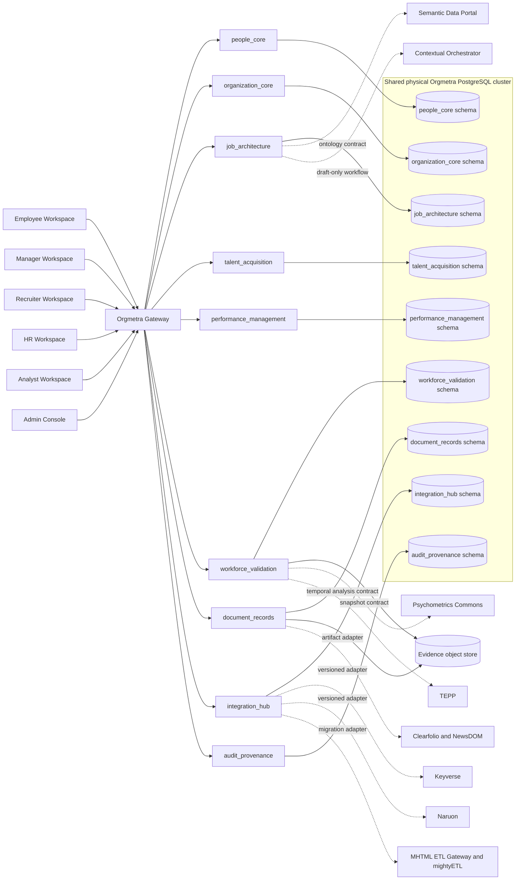

# ARCHITECTURE.md

## Architecture thesis

Orgmetra is a monorepo-hosted, modular, MSA-ready HRIS/HCM platform. It owns employment truth and integrates CWL specialist systems through explicit, versioned contracts.

The diagram shows one physical PostgreSQL cluster for the initial modular deployment, not a shared application schema. Each bounded context owns a separate schema, database role, migration history, and generated data-access layer.

## Runtime layers

1. **Role workspaces**: employee, manager, recruiter, HR, analyst, and admin.
2. **Orgmetra Gateway**: API aggregation, tenant context, purpose-bound authorization, idempotency, and event-envelope handling.
3. **Domain services**: `people_core`, `organization_core`, `job_architecture`, `talent_acquisition`, `performance_management`, `workforce_validation`, `document_records`, `integration_hub`, and `audit_provenance`.
4. **Stores**: service-owned PostgreSQL schemas, evidence object store, audit/provenance store, and search/vector store.
5. **External CWL services**: Keyverse, Naruon, Psychometrics Commons, TEPP, Semantic Data Portal, Contextual Orchestrator, Clearfolio, NewsDOM, MHTML ETL Gateway, and mightyETL.

## Database ownership and access

The initial deployment may share one physical PostgreSQL cluster. Logical isolation is mandatory:

| Service identifier | Owned schema and representative tables | Database role |
|---|---|---|
| `people_core` | `people_core`: person, name, employment, assignment, compensation, and candidate-worker linkage records | `people_core_role` |
| `organization_core` | `organization_core`: organization units and position records | `organization_core_role` |
| `job_architecture` | `job_architecture`: job profiles, publication evidence, and persisted `job_analysis_snapshot` / task / KSAO rows | `job_architecture_role` |
| `talent_acquisition` | `talent_acquisition`: candidate profiles, selection decisions, and decision evidence | `talent_acquisition_role` |
| `performance_management` | `performance_management`: criterion blueprints and observations | `performance_management_role` |
| `workforce_validation` | `workforce_validation`: validity-study registry and external result references | `workforce_validation_role` |
| `document_records` | `document_records`: document metadata and immutable artifact references | `document_records_role` |
| `integration_hub` | `integration_hub`: idempotency, inbox/outbox, and adapter state | `integration_hub_role` |
| `audit_provenance` | `audit_provenance`: append-only audit and provenance records | `audit_provenance_role` |

A service role may read and write only its owned application tables. Cross-service foreign identifiers are opaque references or explicitly approved database constraints inside the modular deployment. A service must never query another service's application tables directly. Cross-boundary reads and commands use generated OpenAPI clients; asynchronous propagation uses versioned AsyncAPI/CloudEvents contracts. Extraction into separate databases must not change those contracts.

## Evidence object and search store ownership

Non-relational stores never become a back door around service ownership. `document_records` owns canonical document/image artifact objects and their retention/export/delete lifecycle. `workforce_validation` may own immutable derived analysis artifacts. Each object key is bound to one opaque tenant identifier, one owning bounded context, one classification, one retention policy, and one immutable provenance reference. Clients receive short-lived, purpose-bound access through the owning service; bucket- or collection-wide credentials are not exposed to workspaces or peer services.

The search/vector store is a derived index, not a system of record. Its write boundary is an `integration_hub` indexing adapter consuming versioned owner events. Each indexed segment carries tenant, source-owner, source-version, field-sensitivity, retention-expiry, and provenance metadata. Query filters must enforce tenant and authorized field sensitivity before ranking or vector similarity. Deletion, legal hold, correction, retention expiry, and export events from an authoritative owner are propagated idempotently to every derived index; a stale or unverifiable index entry is excluded rather than served.

Both stores require encryption in transit and at rest, deny-by-default tenant and field ACLs, immutable access/audit events routed to `audit_provenance`, lifecycle reconciliation, and export inventories that map every derived object back to its authoritative record/version. Cross-context access uses the owning service's published artifact/search adapter contract; direct object-store or vector-store reads by another domain service are prohibited. Search results and object references never grant employment-decision authority by themselves.

## Data ownership

Orgmetra is authoritative for employment facts. It stores foreign references to external artifacts but not external service internals. External products can provide evidence and computation but do not own employment truth.

## Service extraction strategy

The foundation starts as a monorepo with separately deployable services. Each service owns its schema, migration path, database role, API, events, telemetry namespace, and release identity. Physical co-location is an implementation choice, not permission to bypass service boundaries.

## Security posture

Access is tenant-, actor-, purpose-, resource-, and lifetime-scoped. High-impact decisions require preview, explicit human confirmation, versioned evidence, immutable decision records, and attributable audit events. LLM outputs are draft evidence only.
