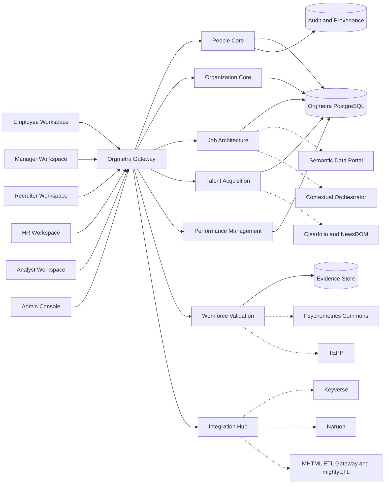

# ARCHITECTURE.md

## Architecture thesis

Orgmetra is a monorepo-hosted, modular MSA-ready HRIS/HCM platform. It owns employment truth and integrates CWL specialist systems through explicit contracts.

## Runtime layers

1. **Role workspaces**: employee, manager, recruiter, HR, analyst, admin.
2. **Orgmetra Gateway**: API aggregation, tenant context, purpose-bound authorization, idempotency, event envelope handling.
3. **Domain services**: people-core, organization-core, job-architecture, talent-acquisition, performance-management, workforce-validation, document-records, integration-hub, audit-provenance.
4. **Stores**: HRIS PostgreSQL, evidence object store, audit/provenance store, search/vector store.
5. **External CWL services**: Keyverse, Naruon, Psychometrics Commons, TEPP, Semantic Data Portal, Contextual Orchestrator, Clearfolio, NewsDOM, MHTML ETL Gateway, mightyETL.

## Data ownership

Orgmetra is authoritative for employment facts. It stores foreign references to external artifacts but not external service internals. External products can provide evidence and computation but do not own employment truth.

## Service extraction strategy

The foundation can start as a monorepo with separately deployable services. Services communicate by OpenAPI, AsyncAPI/CloudEvents, and generated clients. Cross-service SQL is prohibited.

## Security posture

Access is tenant, actor, purpose, resource, and lifetime scoped. High-impact decisions require evidence, explicit decision records, and human accountability. LLM outputs are draft evidence only.

## Active implementation slice: bitemporal domain kernel

`packages/orgmetra-domain` implements framework-independent invariants for effective/system time, distinct HRIS records, multiple assignments, and candidate-worker continuity. It has no persistence or transport dependency and can be embedded by future services. This section describes active-PR work until merged into protected `main`.

## Active implementation slice: purpose-bound People API

`services/people-api` is an independently importable FastAPI factory. Hosts inject `TokenAuthorizer` and `PeopleRepository`. Protected routes select both an OAuth operation scope and a finer HR purpose in server code. `PurposeContext` and the repository port are runtime `Depends` values, not caller query fields. This section describes active-PR work until merged into protected `main`.
