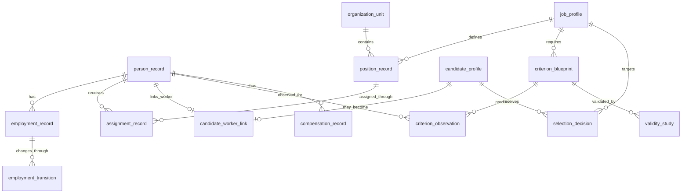

# ERD

## Naming contract

All persisted object names use descriptive two-or-more-word `snake_case` identifiers. Single-token database object names are prohibited unless required by an external standard and approved by ADR.
