# ERD

For readability, the diagram renders representative `tenant_record` scoping edges rather than repeating the same edge for every tenant-owned relation. The authoritative tenant-isolation contract is `docs/DATA_MODEL.md`: **every owned HRIS fact** stores `tenant_record_id`, every cross-table reference is tenant-qualified, and forced row-level security applies independently to every tenant-scoped table. This omission is visual only; it does not weaken the relational or authorization contract for employment, candidate, conversion, evidence, decision, validation-link, compensation, transition, audit, outbox, or outbox-escalation entities.

```mermaid
erDiagram
    tenant_record ||--o{ person_record : scopes
    tenant_record ||--o{ organization_unit : scopes
    tenant_record ||--o{ job_profile : scopes
    tenant_record ||--o{ audit_event_record : scopes
    tenant_record ||--o{ outbox_delivery_escalation_record : scopes
    person_record ||--o{ person_name_record : has_names
    person_record ||--o{ employment_record : has
    employment_record ||--o{ employment_record_version : has_versions
    organization_unit ||--o{ organization_unit_version : has_versions
    organization_unit_version }o--o| organization_unit : may_parent
    organization_unit ||--o{ position_record : contains
    job_profile ||--o{ job_profile_version : has_versions
    job_profile ||--o{ position_record : defines
    position_record ||--o{ position_record_version : has_versions
    employment_record ||--o{ assignment_record : covers
    person_record ||--o{ assignment_record : receives
    position_record ||--o{ assignment_record : assigned_through
    candidate_profile ||--o| candidate_worker_link : legacy_link
    person_record ||--o{ candidate_worker_link : legacy_worker
    candidate_profile ||--o{ candidate_worker_conversion_record : converts_through
    person_record ||--o{ candidate_worker_conversion_record : becomes_worker
    employment_record ||--o{ candidate_worker_conversion_record : creates_employment_lineage
    selection_decision ||--o{ candidate_worker_conversion_record : authorizes
    job_profile ||--o{ criterion_blueprint : requires
    performance_cycle ||--o{ criterion_observation : schedules
    criterion_blueprint ||--o{ criterion_observation : produces
    person_record ||--o{ criterion_observation : observed_for
    candidate_profile ||--o{ selection_decision : receives
    job_profile ||--o{ selection_decision : targets
    decision_evidence_set ||--|{ selection_decision_evidence : contains
    decision_evidence_set ||--o| selection_decision : sealed_by
    criterion_blueprint ||--o{ validity_study : defines_criterion
    validity_study ||--o{ validity_study_decision_link : includes_decisions
    selection_decision ||--o{ validity_study_decision_link : observed_predictor_policy
    validity_study ||--o{ validity_study_outcome_link : includes_outcomes
    criterion_observation ||--o{ validity_study_outcome_link : supplies_outcome
    validity_study ||--o{ validity_study_evidence_set_link : preserves_evidence
    decision_evidence_set ||--o{ validity_study_evidence_set_link : supplies_evidence
    person_record ||--o{ compensation_record : has
    employment_record ||--o{ employment_transition : changes_through
    audit_event_record ||--o{ outbox_delivery_record : delivers_through
    outbox_delivery_record ||--o| outbox_delivery_escalation_record : terminally_escalates
```

## Cardinality decisions

`organization_unit`, `job_profile`, `employment_record`, and `position_record` are durable anchors. Mutable names, classifications, parent relationships, titles, families, version codes, and employment or position status live in bitemporal version rows. Positions retain stable organization/job references while retroactive corrections append or supersede version facts rather than rewriting identity. An organization version may reference another durable organization as its parent; self-parenting is rejected at the database boundary. An assignment names the employment that covers it, so a person cannot be assigned through another worker's employment. Exclusive employment versions for one person cannot overlap. An assignment day must land on an `active` or `open` position version, and visible allocations for one seat cannot exceed 1.0000.

Every owned HRIS fact carries `tenant_record_id`. Relationships that cross table boundaries use tenant-qualified foreign keys, and row-level security independently filters every tenant-scoped relation. The tenant column is therefore both a referential-integrity boundary and a runtime isolation boundary, not a caller-supplied business attribute.

`candidate_worker_link` is a legacy compatibility relation: historical cardinality remains one candidate to at most one legacy worker link, but migration 0008 rejects new inserts. New worker creation uses `candidate_worker_conversion_record`. A candidate may have multiple recorded conversion versions across system time, but bitemporal exclusion permits at most one simultaneously visible conversion for overlapping business time. Each conversion references exactly one resulting person, one employment belonging to that person, and one selection decision for the same candidate. That decision must be a human-confirmed `hire` backed by a sealed versioned evidence set. Replacements therefore preserve historical lineage rather than mutating one opaque candidate/person edge.

Each criterion observation belongs to one effective-dated performance cycle so reporting periods remain reconstructable across effective and system time.

A high-impact selection decision seals exactly one versioned `decision_evidence_set`. Evidence members are inserted while the set is open; the decision records the set reference and atomically changes that set to sealed. After sealing, neither new evidence members nor a second decision may reuse that evidence set. This prevents post-decision evidence drift while retaining normalized, version-addressable evidence.

A `validity_study` connects the criterion blueprint to the exact selection decisions, sealed evidence sets, and criterion observations used as outcomes through append-only link relations. This makes predictor/decision-policy evidence and observed outcomes reconstructable without copying specialist-system payloads into Orgmetra.

One immutable `audit_event_record` may have multiple `outbox_delivery_record` rows when the same event must reach multiple delivery targets. The unique `(tenant_record_id, audit_event_record_id, delivery_target_code)` key permits at most one delivery lifecycle per target. Delivery retries mutate only the delivery relation; the canonical event bytes and digest are append-only and therefore cannot drift with transport state.

A delivery can have at most one `outbox_delivery_escalation_record`, enforced by the unique `(tenant_record_id, outbox_delivery_record_id)` key. The escalation row exists only for a terminal `dead_lettered` delivery and records the failure classification, terminal attempt count, recorded time, and an opaque operator/customer escalation reference without copying the event payload. The row is append-only; terminal queue history is not reopened or rewritten.

## Naming contract

All persisted object names use descriptive two-or-more-word `snake_case` identifiers. Single-token database object names are prohibited unless required by an external standard and approved by ADR.
