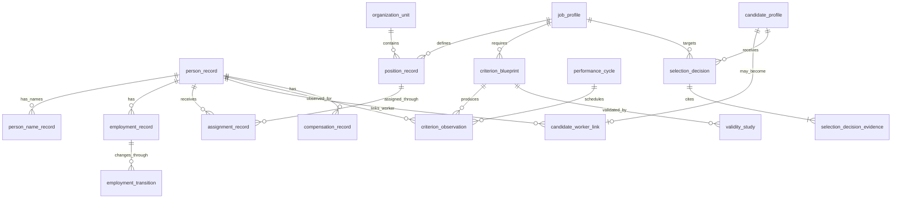

# ERD

## Cardinality decisions

A candidate profile can be linked to at most one worker identity because `candidate_profile_id` is unique in `candidate_worker_link`. A person identity can have multiple candidate-worker links across reapplications or historical candidate profiles, so the person-side cardinality is one-to-many.

Each criterion observation belongs to one effective-dated performance cycle so reporting periods remain reconstructable across effective and system time.

A selection decision requires one or more immutable evidence-reference rows. Evidence versions are stored separately from the decision header to preserve 3NF and permit an auditable evidence set without repeating decision attributes.

## Naming contract

All persisted object names use descriptive two-or-more-word `snake_case` identifiers. Single-token database object names are prohibited unless required by an external standard and approved by ADR.
