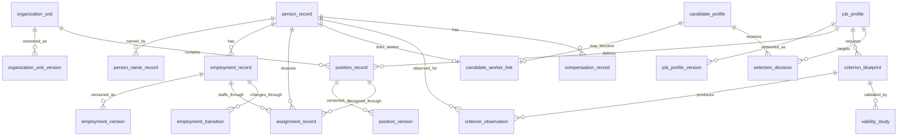

# ERD

Durable anchors (`person_record`, `employment_record`, `organization_unit`, `job_profile`, `position_record`) do not store mutable descriptive facts. Version tables carry effective time and system-recorded time. `assignment_record` names both the person and the employment so rehire and dual employment stay distinguishable.

## Naming contract

All persisted object names use descriptive two-or-more-word `snake_case` identifiers. Single-token database object names are prohibited unless required by an external standard and approved by ADR.
