# Storyboard

```mermaid
flowchart LR
    a[Collect job evidence] --> b[Draft tasks, FJA and KSAO]
    b --> c[SME approves job profile]
    c --> d[Open requisition]
    d --> e[Collect candidate evidence]
    e --> f[Run structured assessment and interview]
    f --> g[Record evidence-backed selection decision]
    g --> h[Link candidate to worker]
    h --> i[Track assignments and performance criteria]
    i --> j[Run validation study]
    j --> k[Revise job profile or selection policy]
```

## Narrative

1. HR imports a job posting, internal job description, public occupational standards, and SME notes.
2. Orgmetra drafts task, FJA, KSAO, qualification, and context profiles with source evidence.
3. SME reviewers approve, edit, or reject each evidence-linked claim.
4. Recruiters evaluate candidates against the published job profile.
5. Interviews focus on evidence gaps and critical KSAO requirements.
6. Selection decisions are recorded with evidence sufficiency and uncertainty.
7. Hired candidates become workers through append-only candidate-worker links.
8. Work opportunities, assignments, and criterion observations accumulate over time.
9. Validation studies analyze predictive validity, bias, criterion quality, and drift.
10. HR revises job architecture, assessment policy, or performance criteria based on evidence.
