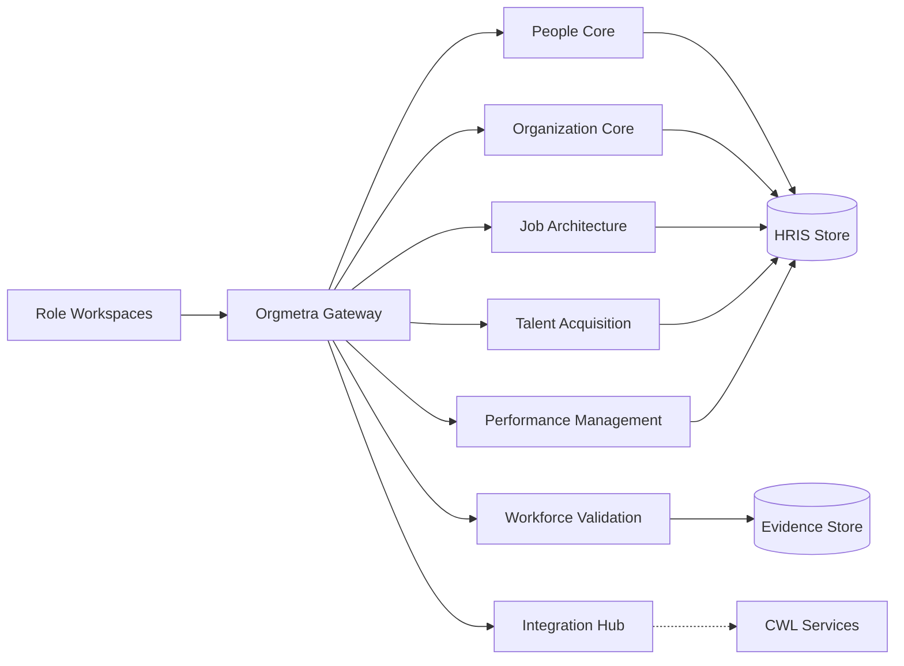
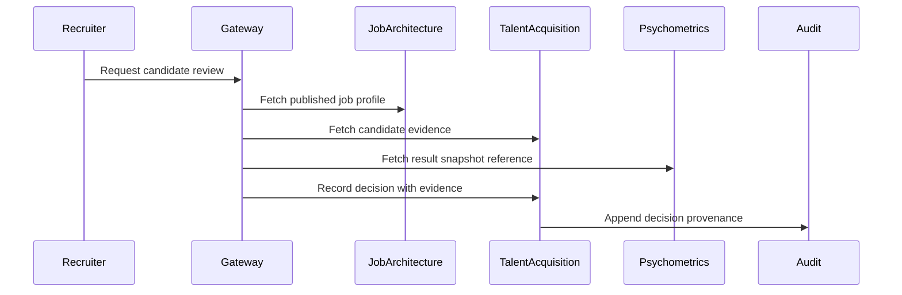
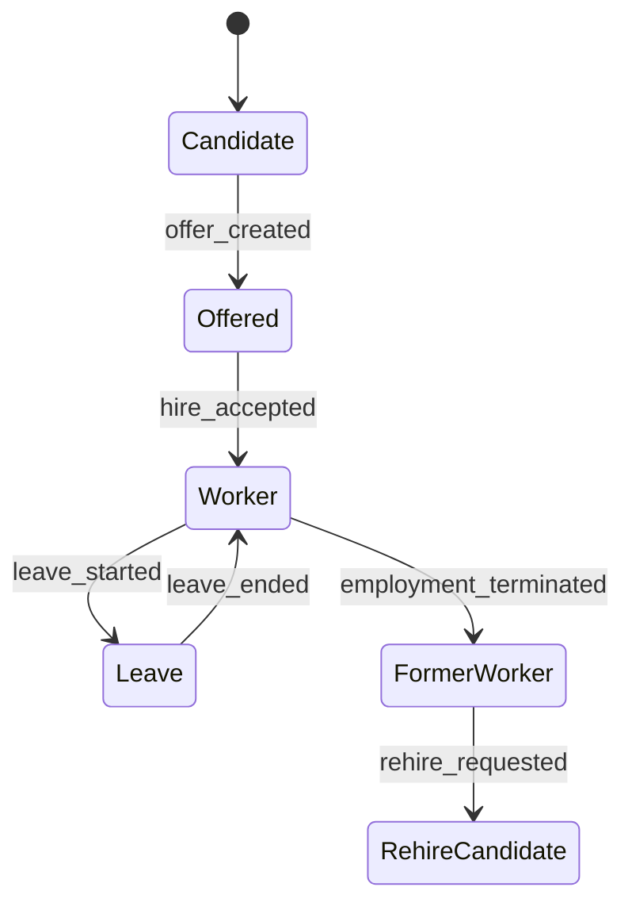

# UML

## Component diagram

```mermaid
flowchart LR
    ui[Role Workspaces] --> gateway[Orgmetra Gateway]
    gateway --> people[People Core]
    gateway --> org[Organization Core]
    gateway --> jobs[Job Architecture]
    gateway --> talent[Talent Acquisition]
    gateway --> performance[Performance Management]
    gateway --> validation[Workforce Validation]
    gateway --> hub[Integration Hub]
    people --> store[(HRIS Store)]
    org --> store
    jobs --> store
    talent --> store
    performance --> store
    validation --> evidence[(Evidence Store)]
    hub -.-> external[CWL Services]
```

## Selection decision sequence

```mermaid
sequenceDiagram
    participant Recruiter
    participant Gateway
    participant JobArchitecture
    participant TalentAcquisition
    participant Psychometrics
    participant Audit
    Recruiter->>Gateway: Request candidate review
    Gateway->>JobArchitecture: Fetch published job profile
    Gateway->>TalentAcquisition: Fetch candidate evidence
    Gateway->>Psychometrics: Fetch result snapshot reference
    Gateway->>TalentAcquisition: Record decision with evidence
    TalentAcquisition->>Audit: Append decision provenance
```

## Employment state model

```mermaid
stateDiagram-v2
    [*] --> Candidate
    Candidate --> Offered: offer_created
    Offered --> Worker: hire_accepted
    Worker --> Leave: leave_started
    Leave --> Worker: leave_ended
    Worker --> FormerWorker: employment_terminated
    FormerWorker --> RehireCandidate: rehire_requested
```
