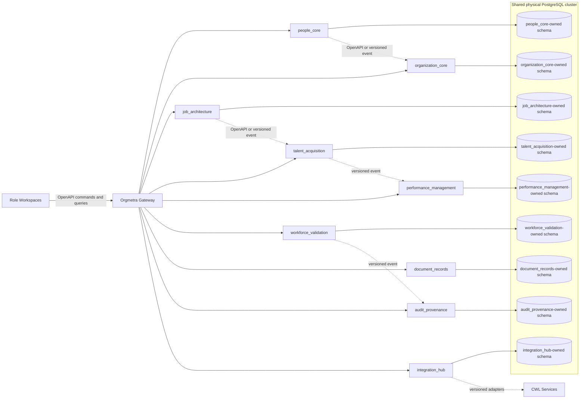
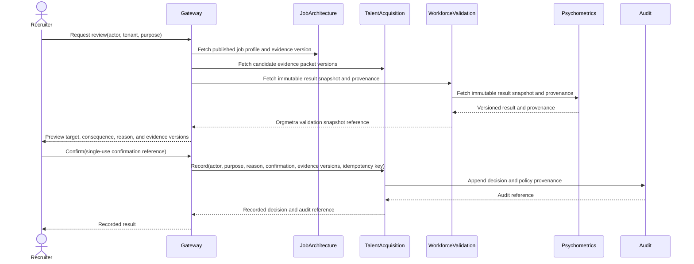
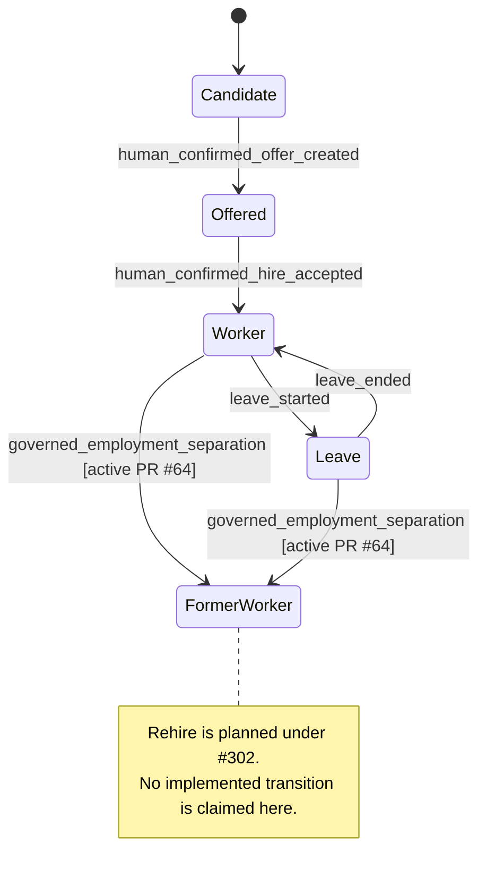
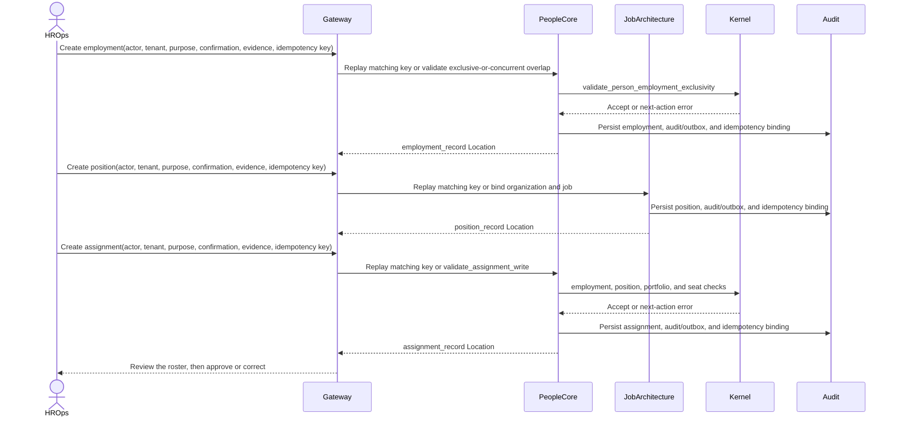

# UML

## Component diagram



The cluster is physically shared in the initial modular deployment. Each bounded context has a separate schema and role; direct reads of another context's application tables are prohibited.

## Selection decision sequence



Only an authorized human can produce the confirmation. LLM and integration identities can draft evidence but cannot call the record transition with a human confirmation. Psychometric snapshots are fetched only through `workforce_validation`; the Gateway never bypasses that owning adapter boundary.

## Employment state model



A second Employment that overlaps an exclusive period is rejected unless it is marked `concurrent`. The active #64 separation path ends one exact current-known Employment through bitemporal supersession; it does not rewrite the prior business fact in place. Rehire remains a downstream #302 contract and, when implemented, is expected to create a new `employment_record` for the existing Person after successful prior separation. Until that contract reaches protected truth, this UML deliberately shows no `FormerWorker -> Worker` or `FormerWorker -> RehireCandidate` production transition.

## Governed Employment-separation sequence

```mermaid
sequenceDiagram
    actor HROps
    participant Gateway
    participant PeopleCore
    participant EmploymentDB as People PostgreSQL
    participant AssignmentBoundary
    participant Audit

    HROps->>Gateway: Preview separation target, consequence, reason, evidence
    Gateway-->>HROps: Exact Employment/version + controlled reason + evidence versions
    HROps->>Gateway: Confirm(single-use confirmation, Idempotency-Key)
    Gateway->>PeopleCore: POST /v1/employment-separations
    PeopleCore->>PeopleCore: Bind tenant, actor, workforce_admin purpose and exact command digest
    PeopleCore->>EmploymentDB: separate exact expected Employment version
    EmploymentDB->>EmploymentDB: Lock idempotency key, then Employment aggregate
    EmploymentDB->>EmploymentDB: Re-read current version and Assignment-conflict truth after lock
    alt stale/future/conflicting Assignment truth
        EmploymentDB-->>PeopleCore: Fail closed; no durable separation side effect
        PeopleCore-->>Gateway: Governed conflict response
        Gateway-->>HROps: Coordinate current truth and retry intentionally
    else authoritative transition accepted
        EmploymentDB->>EmploymentDB: Close recorded interval; add optional continuation + terminal version
        EmploymentDB->>Audit: Persist employment_separated audit/outbox evidence in same transaction
        EmploymentDB->>EmploymentDB: Append employment_separation_record + idempotency result
        EmploymentDB-->>PeopleCore: First durable terminal result or exact-key replay
        PeopleCore-->>Gateway: Governed separation receipt
        Gateway-->>HROps: Recorded terminal Employment state
    end
```

The diagram shows transaction ownership rather than service-to-service SQL. `AssignmentBoundary` remains the owner of Assignment lifecycle; Employment separation never closes or rewrites Assignment rows. Migration 0017 makes Assignment INSERT and separation serialize on the same Employment anchor, with a fresh post-lock coverage read. The separation database function is capability-separated behind dedicated owner/executor roles; application callers do not receive direct People/audit/outbox DML as a substitute.

ADR 0015 remains Proposed. This sequence is active-PR truth on #64, not a protected/released capability, until canonical PostgreSQL execution under #311 and the remaining security/review gates pass.

## Hire-to-assignment sequence


