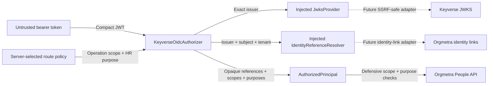
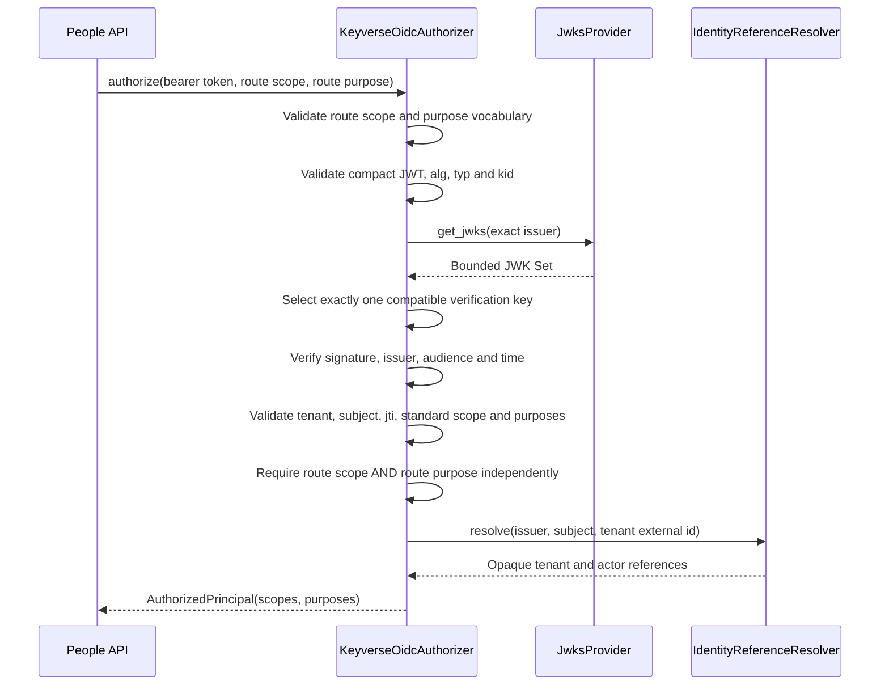
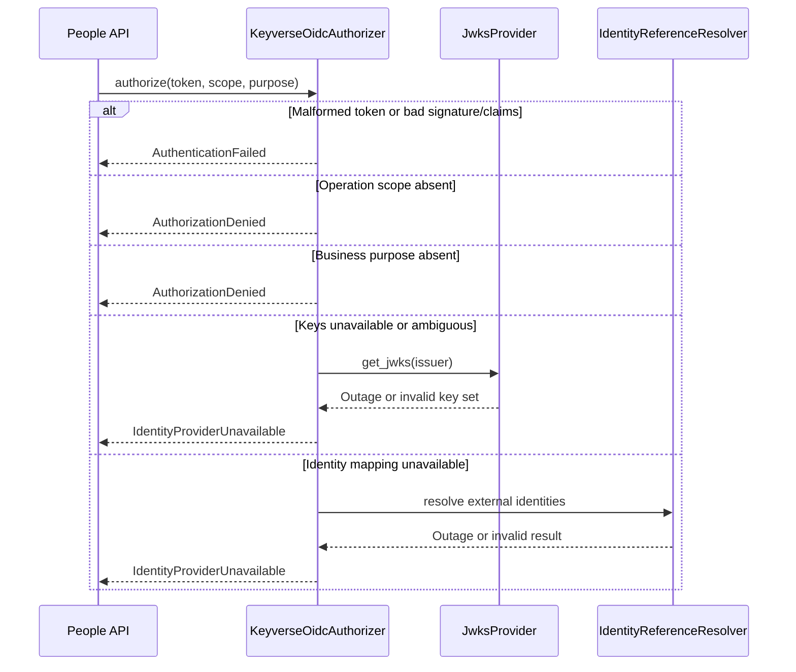

# Keyverse authorization UML views

## Component boundary

## Successful verification sequence

## Failure classification sequence

These views describe active-PR architecture only. They become protected-main
truth after dependency merges and fresh integrated review and checks.
