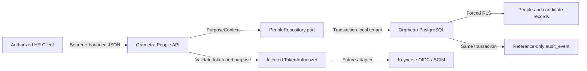
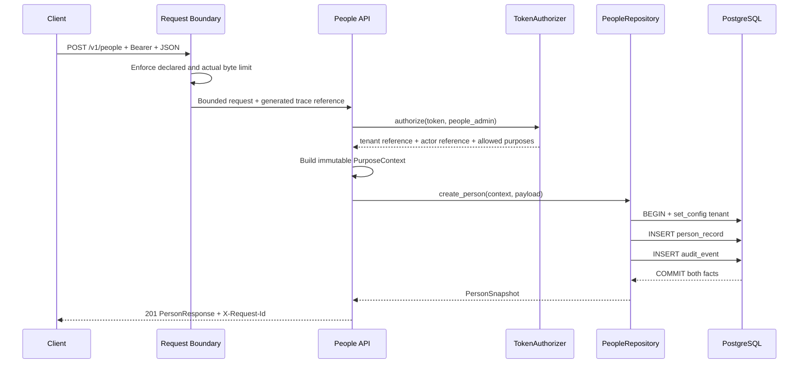
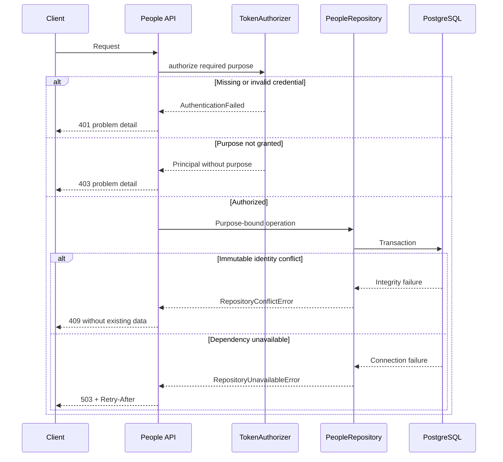

# People API UML views

## Component boundary

## Create-person sequence

## Failure sequence

The diagrams are design authority for this active PR only. They become protected-
main truth only after the full dependency stack merges with fresh checks and
review.
