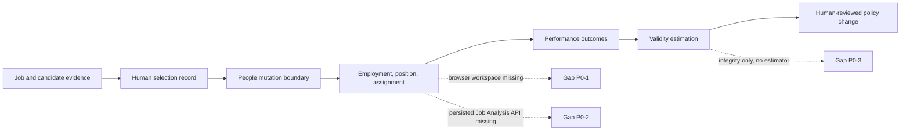

# Orgmetra product and technical gap baseline

**Snapshot:** 2026-08-20, Asia/Seoul
**Evidence base:** local `develop` at `39d3c15e7c47306ec2173d14afcd1c6e1a0139c9`, current protected default branch; GitHub PR metadata, exact-head workflow results, review/thread results, and fresh local validation.

This document is the buyer-facing work queue. It separates what a customer can use from what exists only in an active PR or architecture document. It is updated when a protected merge, exact-head check, review, release, or runtime test changes the evidence boundary.

## Maturity vocabulary

| Value | Meaning |
|---|---|
| `implemented_on_protected_develop` | Executable behavior and its required evidence are on the protected default branch. |
| `implemented_on_active_pr` | Code or tests exist on a current PR, but protected-branch runtime truth is not established. |
| `accepted_architecture` | An owned boundary and contract are accepted, but the buyer workflow is not executable here. |
| `planned` | Product work is named and ordered, but implementation evidence is missing. |
| `research_only` | A paper, prototype, or external product informs a decision; it is not an Orgmetra capability. |
| `superseded` | The artifact must not be revived because a newer owner or contract replaced it. |
| `out_of_scope` | The capability belongs to another product or is intentionally not an Orgmetra decision. |

## Executive finding

Orgmetra is an evidence-centered HRIS foundation with a protected People mutation and confirmed-hire implementation, not yet a complete commercial HCM product. The protected branch provides durable PostgreSQL integrity contracts, a Python HRIS decision kernel, purpose-bound authorization, governed candidate-to-worker lineage, and executable People read/write boundaries. The largest buyer-visible gap remains the missing connected browser product surface: the current checkout has an active-PR HR Home/Employee Profile fixture and local Storybook state runtime, but protected truth has no connected or browser-verified workspace.

The next highest-leverage gaps are one canonical persisted Job Analysis case/API and actual statistical validity estimation. Existing contracts are useful foundations, but they do not substitute for a running customer path or a released deployment.

## Capability truth on protected `develop`

| Capability | Current evidence | Maturity | Buyer consequence |
|---|---|---|---|
| Person, employment, organization, job, position, assignment separation | `database/migrations/0001_foundation_schema.sql`; HRIS kernel tests; bitemporal and tenant contracts | `implemented_on_protected_develop` | Employment truth can be modeled without collapsing stable identities or historical versions. |
| Tenant isolation, append-only history, evidence sealing, audit/outbox integrity | Migrations `0001`–`0012`; PostgreSQL contract suite; `npm run validate` | `implemented_on_protected_develop` | The foundation can reject cross-tenant, temporal, evidence-drift, and unsafe delivery-state writes. |
| Candidate-to-worker conversion | Migration `0009`; `test_candidate_worker_conversion_postgres.sh`; protected traceability; People API hire route | `implemented_on_protected_develop` | Confirmed-hire materialization has a governed HTTP/service boundary; deployment and browser evidence remain separate release work. |
| People read | `services/people-api` GET route, PostgreSQL read adapter, HTTP tests | `implemented_on_protected_develop` | Authorized HR users can read a worker view; responses are no-store and field-scoped. |
| People mutations | Migration `0012`; `services/people-api` hire and mutation routes; current protected service tests and PostgreSQL contract | `implemented_on_protected_develop` | Authoritative person, employment, position, assignment, and confirmed-hire writes have a governed code boundary; hosted/browser release evidence remains open. |
| Job-analysis value objects | `orgmetra_hris_kernel.job_analysis`; exact unit coverage | `implemented_on_protected_develop` | Evidence can be validated in a protected package, but no protected persisted Job Analysis case/workspace exists. |
| Job-analysis persistence/API | PR #38 is the current canonical persistence lane, rebuilt on protected `39d3c15`; PR #30 is closed as superseded | `implemented_on_active_pr` | A buyer cannot yet create, approve, version, or retrieve one canonical persisted Job Analysis case. |
| Performance criterion scope and validity-study case integrity | Migration `0010`/`0011`; PostgreSQL contracts | `implemented_on_protected_develop` | Invalid worker-Job/time links are rejected, but no statistical validity estimate is produced. |
| Statistical validity estimation | Traceability explicitly says estimation is subsequent; no Rust workspace or estimator exists in this repository | `planned` | Customers cannot measure prediction, bias, RMSE/MAE, uncertainty, convergence, temporal effects, or multiple membership. |
| Role workspaces and Storybook runtime | Protected `develop` still has no customer UI; active PR #53 has the HR Home/Employee Profile fixture plus a local Storybook `10.5.10` build | `planned` | The local component/state runtime is reviewable, but there is no connected or released buyer workflow in protected truth. |
| Naruon calendar adapter | `packages/naruon-adapter` package tests; traceability says planned integration | `accepted_architecture` | Calendar intent is contract-tested, not an integrated customer scheduling workflow. |
| TEPP adapter | PR #52 is a non-executing request boundary; no transport contract is established | `implemented_on_active_pr` | Temporal analysis can be prepared as governed evidence but is not executed by Orgmetra. |
| Contextual Orchestrator/OpenCode model path | Named in architecture; no Orgmetra adapter or evidence-backed model evaluation in protected code | `planned` | LLM assistance cannot yet be invoked through an Orgmetra-owned, auditable draft-evidence boundary. |
| Search, semantic chunking, and image understanding | Architecture mentions derived search/vector storage, but no owned schema, chunker, OCR/object metadata, or index adapter is present | `planned` | Evidence retrieval cannot yet preserve paragraph/DOM/image location semantics for customer search. |
| Hot-partition scale strategy | No `PARTITION BY`/partition-management contract in the current migrations | `planned` | Append-heavy audit/outbox and temporal tables need a tested scale plan before high-volume production. |
| CSAP/SOC 2 evidence package | Security, threat, operability, and test documents exist; no control-evidence collection or attestation exists | `accepted_architecture` | The design is compliance-ready in intent, not a certification or audit report. |
| Release artifact | Root package is `0.1.0`; changelog remains `[Unreleased]`; no protected product release was verified | `planned` | Customers have no versioned, supportable Orgmetra product release yet. |

## Local candidate artifact outside protected truth

The current checkout contains `apps/hr-workspace/`, a dependency-free HR Home
and Employee Profile fixture based on Figma nodes `1:10` and `1:28`. It uses
the shared design tokens and proves navigation, focus-visible styling,
keyboard-accessible evidence and confirmation dialogs, purpose-bound
permission denial, exact allocation values, and English/Korean labels. The
fixture explicitly displays that the protected People API is not connected.
The same active PR includes a local Storybook runtime with tokenized stories;
`npm run build-storybook` is a build check, not browser E2E, hosted release, or
protected-develop truth. The artifact must be reviewed, checked, and merged
independently before P0-1 can change maturity.

## Buyer gap backlog

| ID | Priority and owner | Gap and smallest acceptable closure evidence | Dependency |
|---|---|---|---|
| P0-1 | Product / Web | Review and merge the active HR Home + Employee Profile fixture and local Storybook states, then connect it to the protected People API and prove keyboard/focus/permission/confirmation states, exact-value tables, i18n, and browser E2E. | Protected People API evidence |
| P0-2 | Job Architecture | Merge and verify PR #38 as one persisted Job Analysis case: one migration owner, one ADR, versioned source evidence, SME approval, retrieval API, and protected PostgreSQL acceptance test. | Protected People API evidence |
| P0-3 | Workforce Validation / scientific owner | Add a Rust-first estimator boundary or a versioned adapter to `fast-mlsirm`/TEPP. Publish true-parameter recovery, bias, MAE, RMSE, coverage, convergence, temporal, multilevel, multiple-membership, CPU reference, and material GPU parity evidence. | P0-2 and external contract re-resolution |
| P0-4 | Release / Platform | Produce a deployable release with version, changelog, migration inventory, rollback/recovery evidence, support runbook, and exact commit provenance. | P0-1 through P0-3 |
| P1-1 | Integration Hub | Implement contextual-orchestrator adapter for draft evidence only. Pin model/provider/config/evidence digests, use `NVIDIA_NIM_API_KEY` for model-backed development, and record ablations for single-route versus multi-agent depth/access lists. | P0-2; external runtime contract |
| P1-2 | Evidence Platform | Add normalized document/image segment metadata: semantic unit, source location, OCR/object tags, image reference, sensitivity, retention, embedding model/version, and owner provenance. Query filters must run before similarity ranking. | P0-2; document owner contracts |
| P1-3 | Data Platform | Define and rehearse hot-partition strategy for append-heavy audit/outbox and temporal facts, including tenant/time key choice, partition creation, retention, reindexing, and cross-partition query tests. | P0-1; production volume evidence |
| P1-4 | Trust / Operability | Build a CSAP/SOC 2 control matrix with owner, control activity, evidence location, retention, incident path, and release approval. Label it readiness evidence, never certification. | P0-1/P0-2 |

## Current open PR inventory and integration order

The following is the current GitHub inventory checked on 2026-08-20. All listed PRs target `develop`; the protected base observed by the connector is `39d3c15e7c47306ec2173d14afcd1c6e1a0139c9`. `REVIEW_REQUIRED` means the GitHub listing reported that review gate; it is not approval evidence. No self-approval or protection bypass is permitted.

| PR | Head branch / exact head | Scope | Current state | Next action |
|---:|---|---|---|---|
| 53 | `codex/product-gap-baseline-workspace` / live PR #53 exact head | HR Home + Employee Profile fixture and baseline repair | Draft; current base is protected `39d3c15`; seven exact-head runs pending/queued; local validation passes with 59 Node tests; no independent approval | Review the fixture/API boundary, wait for every current-head check, obtain independent approval, then decide whether to merge as a local product-surface slice. |
| 38 | `cursor/job-analysis-snapshot-5eef` / `f7fb7f7f1a160e0c3685a3105f7cb8c7fb34835b` | Canonical Job Analysis persistence/API | Draft; mergeable; base is current `39d3c15`; seven exact-head runs queued/pending; local exact-head suite is 67 passed with 100% statement/branch coverage, root validation 55 tests, and PostgreSQL 16.14 snapshot/schema contracts passed | Wait for terminal exact-head checks, then obtain independent approval; no predecessor evidence transfers. |
| 41 | `feat/candidate-evidence-intake` / `c7934273f6887daf2f222753fdf9cca46734ad88` | Candidate evidence intake | Ready; mergeable; current base `39d3c15`; local exact-head package suite is 75 passed with 100% statement/branch coverage; five fresh hosted checks queued; no qualifying approval | Wait for terminal exact-head checks and independent approval before protected merge. |
| 48 | `feat/governed-compensation-change-review` / `fcefb33c12b0d139077fd693f745871aa1f686e0` | Compensation review packet | Ready; mergeable; current base `39d3c15`; five fresh exact-head checks queued; local package suite 57 passed with 100% statement/branch coverage and root validation 55 tests; no independent approval | Wait for terminal exact-head checks and qualifying independent approval before protected merge. |
| 47 | `feat/governed-employment-leave-review` / `2ed00cedff4652d30dae7f2cde691c0c296f3a91` | Employment leave review packet | Ready; mergeable; current base `39d3c15`; five fresh exact-head checks queued; local package suite 62 passed with 100% statement/branch coverage; no qualifying approval | Wait for terminal exact-head checks and independent approval before protected merge. |
| 46 | `feat/governed-employment-separation-review` / `008feafb68f39b10f89f37152f10622331e77a4d` | Employment separation review packet | Ready; mergeable; current base `39d3c15`; five fresh exact-head checks queued; local package suite 87 passed with 100% statement/branch coverage; no qualifying approval | Wait for terminal exact-head checks and independent approval before protected merge. |
| 45 | `feat/governed-assignment-change-review` / `b41992e666057dba363e3dde3b4a1f3fca87fb19` | Assignment change review packet | Ready; mergeable; current base `39d3c15`; five fresh exact-head checks queued; local package suite 84 passed with 100% statement/branch coverage; no qualifying approval | Wait for terminal exact-head checks and independent approval before protected merge. |
| 44 | `feat/governed-performance-review` / `693bcdf7573f230c0548fa37f0d92d6f63792927` | Performance review packet | Ready; mergeable; current base `39d3c15`; five fresh exact-head checks queued; local package suite 63 passed with 100% statement/branch coverage; no qualifying approval | Wait for terminal exact-head checks and independent approval before protected merge. |
| 43 | `feat/governed-offer-approval` / `f2d80817ec415cfe2728878e09fff92905e7b11f` | Offer approval packet | Ready; mergeable; current base `39d3c15`; five fresh exact-head checks queued; local package suite 84 passed with 100% statement/branch coverage; no qualifying approval | Wait for terminal exact-head checks and independent approval before protected merge. |
| 42 | `feat/selection-outcome-monitoring-plan` / `f7d6a3e4fea8fe8f26564e90644192203815cc91` | Selection outcome monitoring | Ready; mergeable; current base `39d3c15`; five fresh exact-head checks queued; local package suite 96 passed with 100% statement/branch coverage; no qualifying approval | Wait for terminal exact-head checks and independent approval before protected merge. |
| 40 | `feat/structured-interview-plan` / `b4a0a564c8b078d48b917014b97b7e8893a537ad` | Structured interview plan | Ready; mergeable; current base `39d3c15`; five fresh exact-head checks queued; local package suite 72 passed with 100% statement/branch coverage; no qualifying approval | Wait for terminal exact-head checks and independent approval before protected merge. |
| 52 | `feat/tepp-analysis-adapter` / `447ef27fc79792bc55245d18a7d449945b0e63e4` | Governed TEPP request boundary | Draft; mergeable; current base `39d3c15`; five fresh exact-head runs queued; local TEPP suite 46 passed with 100% statement/branch coverage and root validation 55 tests; no independent approval | Keep non-executing; wait for terminal exact-head checks and qualifying review before protected merge. |
| 51 | `docs/protected-truth-refresh` / `4dc8aa58b5d5b6ab0c69da51ba402e92ec6bb35f` | Protected truth/documentation repair | Draft; not mergeable; stale base `ebad8c1`; exact-head local `npm run validate` passed with 56 Node tests, hosted runs not yet materialized | Reconcile this baseline and rebase on `39d3c15`; rerun every applicable gate before review. |
| 37 | `cursor/expand-adr-0001-0003-f381` / `240d2770e5b3109cd1e93c9493d8b6ba685244db` | ADR/reference expansion | Draft; not mergeable; base `f815feed`; only partial checks returned | Close or rebase only after comparing its statements with current protected truth; avoid ADR-number collisions. |

No open GitHub Issue was returned by the current `gh issue list` query. This does not mean product work is exhausted: the backlog above is derived from protected runtime gaps and is intentionally independent of issue presence.

## Loop contract

Every hourly sweep performs the same bounded sequence:

1. Re-fetch the protected `develop` head and current open PR list.
2. For each open PR, inspect current review threads, exact head, mergeability, and all repository/security/recovery/coverage checks.
3. If a review comment identifies a defect, reproduce it on the exact head, make the smallest root-cause repair, and re-run the full affected suite.
4. Never transfer checks or approvals from a predecessor head. Never self-approve, bypass protection, cancel a pending gate to create a result, or call an unmerged PR shipped.
5. Merge only when the current head, current base, required checks, resolved threads, and independent approval satisfy live repository rules. Record the merge SHA and continue to the next dependency-ready lane.
6. If no PR is merge-ready, advance the highest-priority unblocked product gap and leave a verifiable branch/PR artifact.
7. Re-run `npm run validate`, the affected `uv` package suite, PostgreSQL contracts, and browser evidence before release claims.

The loop is an operating procedure, not evidence of completion. Its next customer action must always be explicit: approve, review, correct, request evidence, compare, export, or escalate.

## Standards and research alignment

- ISO 30405:2023 grounds the recruitment lifecycle and the requirement to connect preparation, assessment, stakeholders, review, and learning.
- EEOC Uniform Guidelines and SIOP validity guidance ground job-related selection evidence and prohibit treating a statistical link as sufficient without job scope, criterion integrity, and human governance.
- NIST AI RMF 1.0 requires continuous governance, mapping, measurement, and management of AI risks; Orgmetra therefore keeps LLM output as draft evidence and requires human authority.
- AICPA Trust Services Criteria provide the SOC 2 readiness vocabulary for security, availability, processing integrity, confidentiality, and privacy; Orgmetra has readiness documentation but no attestation claim.
- WCAG 2.2 is the target UI baseline. The existing Figma file and design tokens are inputs; the missing evidence is executable accessibility and interaction testing.
- Fugu, Conductor, and TRINITY support evaluating when a single route is enough and when role-specialized multi-agent depth, recursion, and access lists improve evidence work. Orgmetra must measure this through contextual-orchestrator artifacts rather than assuming multi-agent quality.

The complete APA 7 bibliography is in `docs/doctoring/REFERENCES.md`.

## Fresh local evidence

| Check | Result |
|---|---|
| `npm run validate` | Passed: repository validation and 55 Node tests on protected `develop` `39d3c15`. |
| `packages/hris-kernel` | 171 passed; 100% statement/branch coverage. |
| `packages/keyverse-adapter` | 41 passed; 100% statement/branch coverage. |
| `packages/migration-adapter` | 65 passed; 100% statement/branch coverage. |
| `packages/naruon-adapter` | 41 passed; 100% statement/branch coverage. |
| `packages/requisition-review` | 61 passed; 100% statement/branch coverage. |
| `packages/selection-review` | 68 passed; 100% statement/branch coverage. |
| `services/people-api` | 146 passed; 100% statement/branch coverage. Project-local `tool.uv.sources` now resolves both `orgmetra-hris-kernel` and `orgmetra-keyverse-adapter`; test extras are declared in the service project. |
| PostgreSQL contract suite | 12/12 current protected contracts passed on a dedicated PostgreSQL 16 container, including `test_people_mutation_idempotency_postgres.sh`; the temporary container was removed after the run. |

These results prove the current foundation contracts. They do not prove that open PRs are merged, that a browser UI exists, that a statistical estimator exists, or that Orgmetra is certified under CSAP/SOC 2.
