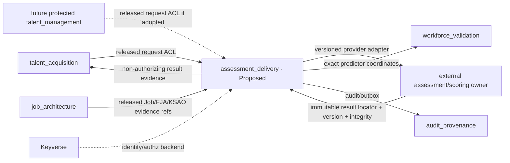

# Assessment assignment and result-handoff boundary traceability

Status: Proposed design evidence for ADR 0429 / Issue #429. Nothing in this document is shipped assessment-delivery capability until the corresponding executable owner contract reaches protected truth.

Protected baseline reviewed: `develop@eb9757f8649aaad026a9865508d9aad50c1a7a4f`.

## Current protected authority

| Protected authority | Existing truth | Assessment-delivery consequence |
|---|---|---|
| `docs/PRD.md` | Orgmetra spans the employment lifecycle; selection evidence and later validity evidence must remain reconstructable | Assessment evidence must retain exact business purpose and downstream decision/study provenance rather than becoming an opaque provider callback |
| `docs/TRD.md` | Assessment results remain external immutable snapshot references unless a later ADR transfers instrument lifecycle ownership | ADR 0429 does not transfer instrument, item-bank, response, scoring-model or psychometric-result ownership |
| `ARCHITECTURE.md` | `talent_acquisition`, `performance_management`, `workforce_validation`, `integration_hub` and other contexts have explicit separate schema/API authority; no assessment context exists | A new context is only Proposed; no existing service may silently claim assessment lifecycle state in the meantime |
| `scripts/foundation-contract-core.mjs` | `assessment_assignment` is already part of the canonical logical database-object vocabulary | The product concept exists, but its aggregate/schema/API ownership must not be inferred from the inventory token |
| `talent_acquisition` boundary | Owns requisitions, candidates, interviews, decision evidence and selection decisions | It may request assessment delivery through an ACL but does not own cross-lifecycle administration state or scientific scoring truth |
| `workforce_validation` boundary | Owns validity studies, exact evidence/outcome linkage, subgroup diagnostics, drift, utility and scientific adapters | It consumes exact released assessment/scoring/admin/result coordinates and remains authoritative for validity/fairness/scientific interpretation |
| `integration_hub` boundary | Owns adapters, inbox/outbox and transport/migration state | Provider transport may be implemented through adapters, but business assessment assignment/admin/result lifecycle is not connector state |
| Keyverse boundary | Identity/authentication backend | Assessment Delivery receives purpose-authorized opaque subject/actor evidence; it does not become an identity store |

## Proposed Context Map

Dashed/future edges are not current product authority. Physical database co-location never permits cross-context application SQL.

## Proposed Ubiquitous Language

| Term | Proposed meaning | Explicit non-meaning |
|---|---|---|
| `AssessmentAssignment` | accountable business request for one purpose/subject/process and exact released assessment procedure contract | provider session, score, selection decision |
| `AssessmentAdministration` | one actual administration occurrence under an assignment | transport retry, assessment instrument definition |
| `provider_session_reference` | external transport/provider coordinate associated with an administration | canonical administration identity by itself |
| `AssessmentResultReference` | immutable external owner locator bound to one administration and exact procedure/scoring contract versions | copied provider payload, locally authoritative score |
| `AssessmentResultSupersession` | append-only predecessor/successor lineage for correction/rescore | in-place result mutation |
| `AssessmentDeliveryPolicy` | operational expiry/idempotency/permitted-purpose/evidence requirements | scoring model, cut score, validity or fairness policy |
| `not_verifiable` | required owner/version/provenance cannot be reconstructed sufficiently for authorized use | zero score, failure-to-pass, neutral scientific result |

## Proposed aggregate and transaction boundary

`AssessmentAssignment` is the aggregate root. One command transaction may validate local current state, append one idempotent assignment/admin/result-reference transition, write correlated audit/outbox evidence and commit. External provider/scoring calls happen after commit and never while an Orgmetra transaction or explicit database lock waits for remote/LLM/scoring work.

A provider callback enters through an idempotent inbox/adapter boundary, resolves one exact tenant/assignment/administration coordinate, validates released contract identity and purpose, and then performs one short domain transition. The callback cannot call a downstream selection/promotion/fairness finalizer in the same authority boundary.

## Ownership matrix

| Fact / behavior | Proposed owner | Consumer(s) | Forbidden shortcut |
|---|---|---|---|
| assessment business request/purpose | `assessment_delivery` | Talent/HR workflows, audit | generic connector metadata as sole authority |
| administration occurrence identity/status | `assessment_delivery` | requester, audit, validation | provider session ID as sole semantic identity |
| instrument/item/content lifecycle | external assessment owner | Assessment Delivery reference only | source copy into Orgmetra |
| response data | external/privacy owner by contract | purpose-bound only if explicitly released | unrestricted HRIS replication |
| scoring algorithm/model | external scoring owner | reference by exact released version | local floating model alias |
| result evidence | external result owner; Orgmetra stores immutable reference | selection/Talent/validation through ACL | digest-only or mutable URL as authority |
| Job/FJA/KSAO job-related evidence | `job_architecture` | Assessment Delivery / selection / validation | copied job semantics |
| employment decision | governed selection or later protected Talent owner | audit, validation | assessment callback finalizes decision |
| validity/fairness/adverse impact | `workforce_validation` | decision governance/reporting | provider completion or raw score treated as scientific GREEN |
| adapter retry/webhook transport | `integration_hub` / released adapter implementation | Assessment Delivery | connector owns business lifecycle |
| identity/authentication | Keyverse | all authorized consumers | Assessment Delivery identity shadow table |

## Contract requirements before implementation may be accepted

A released Assessment Delivery contract must preserve at minimum:

- `tenant_record_id` or equivalent tenant-scoped opaque identity;
- accountable actor and purpose;
- opaque subject reference plus process/Job context required for the purpose;
- stable semantic assignment identity and stable administration occurrence identity;
- external procedure owner and exact released procedure version;
- external scoring owner/version when scoring applies;
- requested/effective/expiry window and operational policy version;
- provider session reference only as transport provenance;
- immutable external result owner locator, result/contract version and integrity evidence;
- explicit lifecycle outcomes including cancellation, expiry, unavailable, interrupted, invalidated and not-verifiable;
- append-only correction/rescore/supersession lineage;
- accommodation/accessibility provenance sufficient to verify correct administration without duplicating unrestricted sensitive detail;
- idempotency, causation/correlation and immutable audit/outbox evidence.

## RED → GREEN verification map

| RED finding | Minimum GREEN evidence |
|---|---|
| floating/mutable procedure or scoring reference accepted | contract/domain tests reject unversioned, mutable or alias-only authority |
| digest without released owner locator accepted | domain tests require owner/context/version/locator + integrity evidence |
| retry creates duplicate administration | PostgreSQL/service contract proves one semantic occurrence across replay while allowing an intentional second administration |
| wrong tenant/subject/purpose/occurrence result accepted | authorization/domain tests fail closed before mutation |
| provider contract drifts between assignment and result | exact historical version binding is persisted and mismatch requires explicit supersession/repair |
| unavailable/interrupted/invalidated/not-verifiable becomes numeric/normal completion | typed-state tests prove non-authorizing semantics end to end |
| rescore overwrites prior result | append-only predecessor/successor tests preserve both historical evidence identities |
| callback advances/rejects/finalizes worker/candidate | architecture/service tests prove no direct high-impact decision command from provider callback boundary |
| external provider call runs inside DB transaction | integration test/telemetry proves commit precedes remote wait and connection/lock cleanup is bounded |
| cross-context SQL or source copy appears | architecture/static contract rejects foreign application-table/source ownership |
| Workforce Validation cannot reconstruct predictor identity | E2E resolves exact assessment/scoring/admin/result coordinates consumed by a study version |
| AI assessment lacks development/scoring/use provenance | result remains `not_verifiable`/non-authorizing until released owner evidence is resolvable |

Synthetic fixtures are suitable for unit/contract failure tests only. Buyer/scientific acceptance requires real or right-cleared assessment-provider evidence whose use permits the asserted verification. No synthetic-only acceptance may be reported as production validity/fairness evidence.

## Standards and scientific traceability

The APA 7 reference set and current standards-status notes are in `docs/doctoring/assessment-assignment-result-handoff-references.md`.

The key standards interpretation is deliberately bounded: ISO 10667-1:2020 supports a client-side lifecycle spanning multiple work-related assessment purposes; ISO 10667-2:2020 defines service-provider concerns; both Edition 3 replacements are still work items. SIOP/AERA-APA-NCME material supports provenance, job-relatedness, reliability/validity/fairness and auditability. None of these sources turns a provider callback into Orgmetra decision authority.

## Documentation/release convergence required for completion

If implementation proceeds, completion requires code-current updates to the canonical Context Map/Architecture, TRD, data model/ERD/UML, API/event contracts, SECURITY, THREAT_MODEL, TEST_STRATEGY, OPERABILITY/recovery and release evidence through their live single-writer owners. `docs/product-technical-gap-baseline.md` remains owned by PR #100 and must not be edited from this ADR lane.

ADR 0429 remains Proposed until those executable contracts reach protected truth. A docs-only merge of this proposal is not sufficient to close Issue #429.