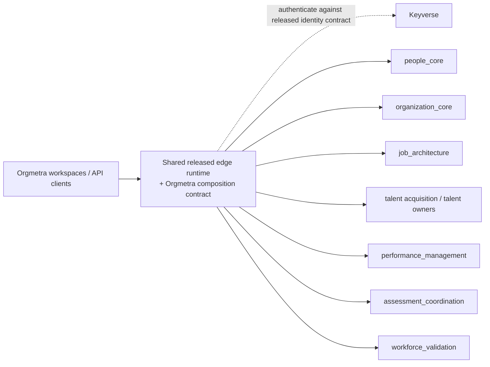

# Gateway composition boundary traceability

Verification date: 2026-09-21

Related issue: #432

Related Proposed ADR: `docs/adr/0432-deployable-orgmetra-gateway-composition-boundary.md`

## Protected-truth RED

Protected `develop@eb9757f8649aaad026a9865508d9aad50c1a7a4f` documents an Orgmetra Gateway in `ARCHITECTURE.md` and gives it pre-handler Keyverse validation responsibility in `docs/API_CONTRACT.md`. The executable repository does not yet expose one supported deployable composition artifact across independently versioned Orgmetra domain services. This document records design/acceptance traceability only; it does not convert the RED into shipped capability.

Fresh shared-owner evidence on 2026-09-21:

- `ContextualWisdomLab/pingora-gateway` protected `main@f8b4c99b8e5d3de79af1ff0c00c0c8fd63b52991` has no published immutable GitHub Release.
- root PR #1 exact `38db1949354f5721dc0ecfeea395bcf958a64ace` remains Draft and records an unresolved PR-introduced OSV finding (`derivative 2.2.0` / RUSTSEC-2024-0388) plus incomplete exact-head central CodeQL evidence.
- therefore no mutable branch, PR commit, copied source/config, or floating image is an admissible Orgmetra production gateway dependency.

## Context Map

The gateway is an application/edge adapter, not a bounded context for HR truth. Each owner service retains its API/domain/persistence invariants and re-authorizes purpose/resource/domain access.

## Ownership matrix

| Concern | Owner | Gateway role | Forbidden gateway behavior |
|---|---|---|---|
| Identity provider, credentials, token issuance | Keyverse | Validate product-facing released OIDC contract | Store credentials/passkeys; become identity authority |
| Person/Employment/Assignment | People | Route and preserve authenticated context | Read/write People tables; decide HR invariants |
| Organization/Position | Organization | Route and preserve context | Read/write Organization tables; synthesize capacity truth |
| Job/FJA/KSAO | Job Architecture | Route and preserve context | Copy job schema or ontology truth |
| Selection/Talent | owning Talent context | Route and preserve context | Make autonomous employment decisions |
| Assessment assignment intent | assessment coordination | Route and preserve context | Own assessment session/scoring/result truth |
| Scientific validity/fairness | Workforce Validation | Route and preserve state/errors | Convert pending/not-verifiable/non-convergence to success |
| Authentication journey | Orgmetra product | Terminate/mediate product transport | Replace product UX with generic proxy behavior |
| Generic proxy/runtime | released shared gateway owner | Execute supported runtime contract | Import mutable shared source into Orgmetra |
| Route/admission/config truth | Orgmetra | Own versioned composition contract | Hide owner contract/version behind floating discovery |
| Mutation idempotency/concurrency | owning domain service | Forward exact coordinates | Mint divergent replay/version truth |

## Composition manifest semantics

The implementation artifact must preserve at least the following semantic coordinates. Names are descriptive, not a frozen serialization schema.

| Coordinate | Why it exists | Acceptance |
|---|---|---|
| `composition_schema_version` | Evolves product composition without silent shape drift | Unknown major fails closed |
| `orgmetra_release` + source identity | Binds product behavior to released product evidence | Mutable/default-branch-only identity is non-production |
| `composition_digest` | Identifies exact route/policy generation | Runtime-reported digest equals deployment evidence |
| shared gateway owner/release/contract/artifact digest | Admits a reusable edge runtime | Missing/unreleased/floating identity fails closed |
| `route_id` | Stable operational/audit coordinate | Unique within one generation |
| path + method set | Declares exposed operation | Must match compatible released owner OpenAPI |
| owner service + owner API release + OpenAPI digest | Keeps route tied to domain owner | Digest/version mismatch prevents admission |
| logical upstream service reference | Resolves deployment target without copying implementation | Cannot be cross-service SQL or mutable source path |
| coarse scope/capability | Early denial before owner call | Cannot enlarge token authority |
| authoritative tenant/actor/purpose locations | Prevents identity-source ambiguity | Contradiction fails closed |
| idempotency mode | Prevents edge-local replay truth | Mutation key forwarded unchanged; owner remains authority |
| concurrency/error preservation | Keeps owner invariants visible | No local version counter or success coercion |
| retry class | Makes ambiguous failure behavior explicit | Default deny for mutations without released replay contract |
| readiness criticality | Separates required from optional product routes | Missing required route makes product unready |

## RED -> GREEN evidence map

| RED / risk | Required GREEN evidence | Owner lane |
|---|---|---|
| Architecture advertises gateway but no deployable composition exists | one supported local + Kubernetes composition artifact bound to immutable identities | #432 implementation successor |
| shared gateway has no release | immutable shared-owner version/tag/artifact + SBOM/provenance/reproducibility/rollback | `pingora-gateway` owner stack |
| shared runtime exact security RED | owner root-cause fix and exact-head security evidence; no advisory suppression | `pingora-gateway` owner stack |
| route exposed without released owner API | startup/admission test rejects missing/floating/incompatible owner contract | #432 implementation successor |
| OpenAPI digest differs from admitted contract | route remains unavailable; readiness evidence names safe route/contract coordinate | #432 implementation successor |
| token issuer/audience/signature/expiry/subject/tenant/actor invalid | request rejected before owner call | gateway security contract |
| token/path/query/header tenant/actor/purpose contradict | deterministic fail-closed rejection; no source precedence guess | gateway + owner contract |
| gateway coarse scope passes but owner purpose/resource rule denies | owner denial preserved; no edge override | gateway E2E + domain owner test |
| gateway mints/changes mutation idempotency coordinate | negative test proves exact client key reaches owner and gateway stores no replay fact | gateway E2E + owner API |
| same key but owner semantic digest differs | owner conflict preserved | owner API + gateway pass-through |
| connection fails after possible mutation commit | no fresh-key automatic replay; only owner-declared same-key replay semantics may run | gateway fault-injection E2E |
| optimistic-concurrency coordinate stale | owner conflict/status preserved | gateway E2E + owner API |
| owner returns authorization/conflict/unavailable/timeout | owner status/versioned error identity preserved; never `200`/empty | gateway E2E |
| owner reports `verification_pending`/`not_verifiable`/non-convergence | semantic state remains distinguishable end-to-end | Workforce Validation/assessment E2E |
| cancelled/timeout/partial response leaks resources | socket/task/pool cleanup evidence under fault injection | gateway runtime test |
| product readiness claims success with missing required route | readiness fails and identifies non-admitted safe route coordinate | operability test |
| stale config activates partially | generation-level validation prevents partial activation | config activation test |
| rollback routes new contract to old owner silently | immutable prior generation activation + compatibility revalidation | recovery rehearsal |
| gateway can reach peer PostgreSQL directly | network/config and code test prohibit cross-service SQL | security/integration test |
| benchmark measures router stub | k6/E2E reaches gateway -> owner HTTP -> PostgreSQL with exact deployment evidence | performance acceptance |

## Retry and failure interleavings

The implementation tests at least these ordered failures rather than only happy-path request/response.

1. owner commits mutation, response is lost, gateway observes transport failure;
2. gateway receives a client retry with the exact same `Idempotency-Key`;
3. owner replay contract returns the original committed identity;
4. gateway preserves that response without creating another mutation identity.

A companion negative case uses an owner route that does not publish replay safety. After the ambiguous transport failure, the gateway does not invent an automatic retry.

Additional interleavings:

- generation N validates while generation N+1 begins validation: only one complete generation activates at a time;
- required owner contract changes between config build and activation: digest mismatch blocks activation;
- optional owner becomes unavailable after activation: route is explicitly unavailable while required-route readiness semantics remain deterministic;
- request cancellation races owner response: cleanup happens once, and a late owner completion cannot be reported as client success after cancellation;
- token/JWKS refresh races a request: a failed/unknown key does not downgrade to unsigned or stale-unbounded acceptance.

## Performance evidence

The measured ordinary buyer path is:

`k6/client -> shared gateway runtime -> owner HTTP service -> PostgreSQL -> owner -> gateway -> client`

For paths designated applicable to the commercial latency target:

- target: p95 <= 20 ms;
- record sample size, concurrency, duration, deployment identity, dataset/right-to-use, PostgreSQL/schema/index/RLS state, auth/audit state, gateway release/artifact digest, composition digest, owner API release/OpenAPI digest, hardware/runtime, and observation timestamps;
- report gateway overhead separately from owner execution;
- report connection-establishment/cold and steady-state windows when they differ materially;
- do not discard slow requests, shrink the sample to make the target pass, disable auth/audit, or substitute an in-memory owner/router.

A failed target triggers profile evidence across DNS/connect/TLS or service-connect, gateway queueing, auth validation, serialization, upstream pool acquisition, owner authorization/query/transaction, forwarding, and cleanup before any runtime/language replacement.

## Deployment and recovery evidence

GREEN requires both supported development and production-oriented composition:

- Podman/Colima local composition with production-equivalent service boundaries;
- supported Kubernetes manifests/packaging with immutable image/artifact identities;
- PostgreSQL with owner schemas/roles rather than cross-schema gateway credentials;
- separate liveness, config-validity, route-admission, and product-readiness signals;
- bounded graceful shutdown and in-flight drain;
- immutable generation activation/rollback;
- rollback rehearsal proving the restored generation still admits exactly the compatible owner contracts it claims; and
- logs/metrics/traces that avoid raw credentials, restricted-HR payloads, stack traces in client responses, and unbounded tenant/person labels.

## Canonical single-writer handoff

This PR must not edit the existing canonical surfaces owned elsewhere:

- #51: `ARCHITECTURE.md`, TRD, API_CONTRACT, SECURITY, THREAT_MODEL, TEST_STRATEGY, OPERABILITY, TRACEABILITY and deterministic manifest reconciliation;
- #100: `docs/product-technical-gap-baseline.md`;
- #427: Workforce Validation HTTP semantics;
- domain-owner PRs: owner OpenAPI/domain contract truth.

After ADR 0432 is protected, #51 may reconcile the selected target architecture into canonical docs. #100 may move `API-01` only when protected/released evidence justifies a state change. A Proposed/Draft ADR is not shipment.
