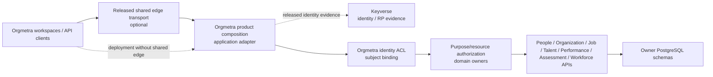

# Gateway composition boundary traceability

Verification date: 2026-09-22

Related issue: #432

Related Proposed ADR: `docs/adr/0432-deployable-orgmetra-gateway-composition-boundary.md`

## Protected-truth RED

Protected `develop@eb9757f8649aaad026a9865508d9aad50c1a7a4f` still documents one buyer-visible Orgmetra Gateway while protected executable truth has no supported deployable product-composition application across independently versioned owner services. Protected `docs/API_CONTRACT.md`, `docs/TRD.md`, `schemas/openapi.yaml`, and Foundation validation retain OpenAPI 3.2.0. This file records design and acceptance evidence only; Draft implementation does not become shipped truth.

`API-01` therefore remains Planned. #100 remains the only writer for `docs/product-technical-gap-baseline.md`, and #51 remains the protected architecture/technical-document reconciliation owner after architecture admission.

## Current executable stack

| Layer | Owner | Exact candidate | What it proves | What it does not prove |
|---|---|---|---|---|
| Process-local route/generation admission | #434 | `68bdf2d984ca7686219c335a85a6574195675cbe` | canonical route/config identity, bounded OpenAPI path authority, nested construction/use-time integrity | durable generation/deployment authority, HTTP host, released owner evidence |
| Durable generation/configuration | #436 | `98b4b129073a2afc70f8a533e34c31fdcc15ab07` | normalized reconstructable generation material, atomic registration, non-reassignable `generation_id`, append-only registry | deployment authorization/recovery, identity/ACL release evidence |
| Durable activation/recovery | #437 | `2f3592ab777b92720f3fdac60f38e28752fcf502` | append-only activation/rollback, transition-bound external evidence, DB-clock owner observation validity, durable recovery attestation, transactionally fenced and deterministically exercised migration upgrade | protected exact-head GREEN, immutable external production releases, deployable HTTP composition, buyer-path SLO |

#434 remains stacked on #340 exact `28f2bd28414e217f7e848ba86c0cfdbe97fd518f`. #436 is directly stacked on #434. #437 is directly stacked on #436 and is 86 commits ahead / 0 behind that exact parent at this verification point. All are Draft/unprotected candidates.

## Ownership map

Product composition is an application adapter, not another HR bounded context. It owns no Person, Employment, Assignment, Organization, Position, Job Architecture/FJA/KSAO, Talent, Assessment, Performance, or Workforce scientific truth. It does not query owner application tables. Keyverse retains credential/identity authority; Orgmetra identity/ACL owners retain subject binding; domain owners retain purpose/resource authorization, idempotency, concurrency, retry/replay semantics, errors, and scientific states.

## Admission authority — #434

Current #434 exact authority is `68bdf2d984ca7686219c335a85a6574195675cbe`, 114 commits / 17 changed files on its current parent. Its relevant invariants include:

- exact owner release/OpenAPI/artifact/repository attribution and owner-bound logical upstream;
- one exact release identity per owner `service_id` in one generation;
- one exact owner release per exact Path Item in the current bounded product profile;
- deterministic configuration digest over canonical route material;
- fail-closed canonical owner/route/generation identifiers and path-template expressions;
- parameter-name-independent OpenAPI path identity;
- same-owner concrete-before-template precedence only when owner release and declared method set agree;
- cross-owner concrete/template overlap and ambiguous templated overlap rejection;
- operation authority separated from path matching, with GET/HEAD sharing selected-resource collision authority while declared methods remain exact material;
- rejection of URI `.`/`..` segments and repeated template expressions;
- process-local construction snapshots for owner-release, route, generation, deployment/evidence values where defined; and
- canonical process-local receipt issuance and use-time revalidation.

A process-local snapshot or receipt proves only that one live object/graph has not been reinterpreted. It is not cross-process release or activation authority.

## Durable generation/configuration authority — #436 / migration 0018

#436 exact `98b4b129073a2afc70f8a533e34c31fdcc15ab07` projects one admitted generation into normalized generation, owner-release, route, and route-method rows through `PostgresGenerationRegistry`.

Required evidence properties:

- one `generation_id` cannot be reassigned to different semantic material;
- exact re-registration is idempotent only for the complete identical durable record set;
- generation/children persist atomically;
- reload reconstructs fresh canonical #434 values and recomputes `config_sha256`;
- missing, split, or forged route/release material cannot be accepted merely because a stored digest matches a caller value; and
- UPDATE, DELETE, and TRUNCATE cannot rewrite registry history.

This layer stores composition truth only. It does not copy owner tables, tenant/Person data, Keyverse data, or scientific state.

## Durable activation/recovery authority — #437 / migrations 0019–0022

Current ordered migration chain is **0018 -> 0019 -> 0020 -> 0021 -> 0022**.

### 0019 — deployment, evidence, activation sequence

`0019_product_composition_activation_registry.sql` introduces explicit non-PII deployment/environment identity, content-addressed external authority evidence, exact owner-operation observations, and append-only activation events. Per-deployment `FOR UPDATE` serializes compare-and-append state. Rollback is another event targeting previously active immutable generation material.

External evidence is evaluated before the deployment lock. After lock acquisition, durable state is rechecked before the event is appended. Composition therefore avoids holding remote network I/O under the local transaction lock.

### 0020 — evidence-bound current activation

`0020_product_composition_activation_authority_enforcement.sql` refuses predecessor NULL-evidence activation history and requires current activation events to identify the exact evidence bundle that authorized them. Evidence-free structural activation remains only a predecessor-schema/fault-test primitive, not current production authority.

### 0021 — database-clock owner-observation authority and upgrade fencing

`0021_product_composition_activation_observation_wall_clock.sql` makes PostgreSQL reject owner-operation observations dated after database wall clock or already stale at persistence. It also refuses upgrade over predecessor future-dated history.

Fresh review found the predecessor migration performed the history scan and trigger installation in separate autocommitted statements. A concurrent predecessor-schema writer could therefore insert impossible future-dated evidence after preflight, commit while `CREATE TRIGGER` waited, and leave that row grandfathered into the upgraded schema.

The repair sequence is:

- `0c4e4972ddf3b10e58b0da1983f91a71299454ee` — RED/static contract requires one explicit transaction and a writer-conflicting migration fence around scan plus guard installation.
- `e61fdcc775db7fb0fbdb66cf662456f43911f9d9` — migration acquires `SHARE ROW EXCLUSIVE` on `product_composition_activation_owner_observation` before scanning predecessor history and retains it through permanent INSERT-guard creation.
- `012c90889ea78db4baa18a2a7973717d00301be1` — native PostgreSQL upgrade contract starts a concurrent predecessor writer and requires the fenced migration to fail closed on the committed impossible row.

A second review found that the first concurrent test used a fixed `sleep 1` to infer that the background writer had reached the intended transaction state. That was scheduler-sensitive and could exercise a different ordering on a slow runner. The test evidence was repaired rather than accepted as-is:

- `3e868e804e7aeb15386e1f2b1e3b52a354b448e2` — RED/static contract requires database-observed writer readiness and forbids the fixed `sleep 1` handshake.
- `2f3592ab777b92720f3fdac60f38e28752fcf502` — writer connection is tagged with `PGAPPNAME=orgmetra_wall_clock_upgrade_writer`; the shell contract polls `pg_stat_activity` until PostgreSQL reports that exact backend active inside its post-INSERT `SELECT pg_sleep(...)`, then starts migration 0021. If readiness is not observed, the contract fails explicitly.

This turns the hostile interleaving from a scheduler-timing assumption into database-state evidence. The migration policy itself is unchanged.

### 0022 — durable restart re-admission

`0022_product_composition_recovery_attestation.sql` records each successful fresh restart re-admission as append-only history bound to exact deployment, current activation sequence, generation, and fresh `authorization_action='recover'` evidence.

The product path obtains fresh remote recovery evidence outside the deployment lock, then locks the deployment and requires the exact active sequence/generation to remain unchanged. It reconstructs generation material again, persists/verifies the evidence bundle, and appends the next recovery attestation atomically. PostgreSQL independently rechecks recovery action/state binding, evidence expiry, and exact fresh owner-operation coverage. UPDATE, DELETE, and TRUNCATE of recovery history are rejected.

A historical activation event therefore remains historical activation evidence; restart authorization is separately attributable rather than silently rewriting the old event.

## External authority boundary

Production positive activation/recovery still requires actual immutable released evidence, not release-shaped fixtures:

- Keyverse released consumer/RP evidence for verified identity;
- immutable Orgmetra subject-binding / ACL / purpose-policy evidence;
- exact released owner API/OpenAPI/artifact coordinates;
- one fresh owner-operation observation for every admitted route/path/method/release coordinate; and
- exact authorization action plus durable state sequence.

Composition may deny early but may not create Person truth or replace owner authorization. Missing, duplicate, stale, future-dated, wrong-generation, wrong-action, wrong-state, wrong-owner, or incomplete operation evidence fails closed.

## Canonical execution dependency

#260 owns repository-level service runtime discovery/compatibility. Product composition must be evaluated from its own dependency closure rather than inheriting People/Job Analysis runtime floors by name.

#311 owns fail-closed PostgreSQL Foundation root discovery/execution. Its current Draft exact head remains on the #259 stack and intentionally fails when an exact candidate contains an unregistered `tests/test_*_postgres.sh` root. It must not copy mutable #437 files or register phantom paths. Once canonical discovery/execution reaches protected truth, the composition owner must ordinary-forward adopt that protected owner and register/execute its roots from the same exact candidate tree.

Current composition acceptance must then include:

- `services/product-composition-api` under its truthful declared interpreter/dependency closure;
- exact pytest configuration and 100% owned statement/branch coverage;
- migration order 0018→0019→0020→0021→0022;
- current generation/activation/authorization/truncate/wall-clock contracts;
- `tests/test_product_composition_activation_observation_wall_clock_upgrade_postgres.sh` with database-observed concurrent writer readiness; and
- `tests/test_product_composition_recovery_attestation_postgres.sh`.

A predecessor-schema, predecessor-head, source-tree `PYTHONPATH`, or feature-local workflow result cannot substitute for this evidence.

## RED → GREEN evidence map

| RED / risk | Required GREEN evidence | Owner |
|---|---|---|
| documented Gateway but no deployable composition | supported local/Kubernetes HTTP composition bound to immutable identities | #432 |
| owner route lacks immutable release/operation authority | released OpenAPI/artifact + operation conformance, fail closed when absent | #432/#434 + owner |
| process-local value retargeted after construction | construction/use-time integrity rejects retarget; new meaning requires new value | #434 |
| same generation ID acquires new durable meaning | normalized registry rejects reassignment and reconstructs digest from durable material | #436 |
| partial generation rows become activatable | atomic registration and reconstruction fail closed | #436 |
| activation event has no external authority | current schema requires exact evidence bundle and complete operation observations | #437 / 0020 |
| authorization decision replayed for another action/state | exact action + authorized state sequence enforced in code and DB | #437 |
| owner observation claims future/stale knowledge | Python validation plus PostgreSQL wall-clock rejection | #437 / 0021 |
| concurrent predecessor writer crosses 0021 preflight/guard gap | transaction + `SHARE ROW EXCLUSIVE` fence + concurrent native regression | #437 / 0021 |
| race test passes because runner scheduling happened to match | observe exact writer backend state in PostgreSQL before starting migration | #437 tests |
| restart is considered authorized only in process memory | append-only fresh recovery attestation bound to current sequence/generation/evidence | #437 / 0022 |
| composition queries peer HR tables | service credentials/code/network tests prohibit cross-service SQL | security/domain owners |
| owner denial/scientific non-success becomes success | exact status/state/error identity preserved end-to-end | composition + owners |
| benchmark omits deployed layer/database/auth/audit | complete deployed buyer path with separated layer costs | performance acceptance |
| Draft source is treated as shipped truth | #51/#100 reconcile only after normal protected integration | #51/#100 |

## Verification boundary

#433's earlier exact source head `912fa44ec3b928500acea0291103cb41f6a6d7fc` had terminal Foundation, SAST, Security, and CodeQL success but no submitted review. ADR/TRACEABILITY have changed materially to reflect #436/#437 and the deterministic concurrency evidence, so those predecessor check results do not transfer. Fresh exact-head hosted evidence is required before architecture admission.

#437 exact `2f3592ab777b92720f3fdac60f38e28752fcf502` remains Draft and has no PR-triggered hosted run at this verification point because it is stacked on #436 rather than protected `develop`. Its Python/static/PostgreSQL contracts are source evidence, not exact-head GREEN.

#340 remains an inherited Foundation prerequisite with Foundation/SAST/Security success but a required CodeQL failure. #259 remains Draft with Security and CodeQL failures. #311 remains Draft on #259 and has no protected-base PR-triggered run. These owners must resolve normally; no leaf shim, synthetic status, blind/no-op rerun, self-approval, routine administrator bypass, or gate weakening is valid evidence.

## Remaining buyer-visible acceptance

The composition gap remains open until the following converge on protected/released truth:

1. normal architecture admission for ADR 0432;
2. canonical service/PostgreSQL exact-candidate execution and 100% owned coverage;
3. actual immutable Keyverse/Orgmetra/owner releases and positive activation/restart recovery against them;
4. a deployable HTTP composition host preserving identity, authorization, owner errors and replay/concurrency semantics;
5. supported local/Podman/Colima and Kubernetes operation, rollback and recovery;
6. security, fault, cancellation and resource-cleanup acceptance;
7. full applicable path `client/k6 -> [shared edge if deployed] -> composition -> owner HTTP -> PostgreSQL -> owner -> composition -> [edge] -> client` at p95 <=20 ms without reduced samples, discarded slow requests, disabled auth/audit, mocked owner/DB, or warm-cache-only substitution;
8. #51 protected documentation/manifest reconciliation and #100 buyer-gap reconciliation; and
9. version/CHANGELOG/tag/package/immutable release/SBOM/provenance/reproducibility/rollback evidence.

No open PR, synthetic fixture, commit SHA, process-local receipt, or mutable branch is release authority.
