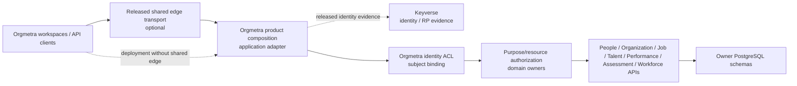

# Gateway composition boundary traceability

Verification date: 2026-09-23

Related issue: #432

Related Proposed ADR: `docs/adr/0432-deployable-orgmetra-gateway-composition-boundary.md`

## Protected-truth RED

Protected `develop@eb9757f8649aaad026a9865508d9aad50c1a7a4f` still documents one buyer-visible Orgmetra Gateway while protected executable truth has no supported deployable product-composition application across independently versioned owner services. Protected `docs/API_CONTRACT.md`, `docs/TRD.md`, `schemas/openapi.yaml`, and Foundation validation retain OpenAPI 3.2.0. This file records design and acceptance evidence only; Draft implementation does not become shipped truth.

`API-01` therefore remains Planned. #100 remains the only writer for `docs/product-technical-gap-baseline.md`, and #51 remains the protected architecture/technical-document reconciliation owner after architecture admission.

## Current executable stack

| Layer | Owner | Exact candidate | Current evidence | Not yet proved |
|---|---|---|---|---|
| Process-local route/generation admission | #434 | `68bdf2d984ca7686219c335a85a6574195675cbe` | canonical route/config identity, bounded OpenAPI path authority, nested construction/use-time integrity | durable generation/deployment authority, HTTP host, released owner evidence |
| Durable generation/configuration | #436 | `5fd0087179f2e6f23f2bb3853ad1de397fc53b0e` | normalized reconstructable generation material, non-reassignable `generation_id`, append-only registry, atomic and hostile-search-path-safe 0018 publication | deployment authorization/recovery, identity/ACL release evidence |
| Durable activation/recovery | #437 | `960a5fbfcb98075862cdbee8ee094a9b8d7dcc55` | 0019→0025 activation/recovery authority, DB-clock freshness, durable recovery attestation, upgrade fencing, deployment-row serialization, full-chain schema provenance, trigger/relation provenance, process-local runtime-capability integrity, no-ambiguous-post-commit recovery | protected exact-head GREEN, immutable external production releases, deployable HTTP composition, buyer-path SLO |

#434 is stacked on #340 exact `28f2bd28414e217f7e848ba86c0cfdbe97fd518f`. #436 is the durable generation/configuration child and #437 is directly stacked on #436. All are Draft/unprotected candidates. Their source is implementation evidence, not release authority.

## Ownership map

Product composition is an application adapter, not another HR bounded context. It owns no Person, Employment, Assignment, Organization, Position, Job Architecture/FJA/KSAO, Talent, Assessment, Performance, or Workforce scientific truth. It does not query owner application tables. Keyverse retains credential/identity authority; Orgmetra identity/ACL owners retain subject binding; domain owners retain purpose/resource authorization, idempotency, concurrency, retry/replay semantics, errors, and scientific states.

## Admission authority — #434

Current #434 exact is `68bdf2d984ca7686219c335a85a6574195675cbe`. Relevant invariants include:

- exact owner release/OpenAPI/artifact/repository attribution and owner-bound logical upstream;
- one exact release identity per owner `service_id` in one generation;
- one exact owner release per exact Path Item in the bounded product profile;
- deterministic configuration digest over canonical route material;
- fail-closed canonical owner/route/generation identifiers and path-template expressions;
- parameter-name-independent OpenAPI path identity;
- deterministic same-owner concrete-before-template precedence only when owner release and declared method set agree;
- cross-owner concrete/template overlap and ambiguous templated overlap rejection;
- operation authority separated from path matching, with GET/HEAD sharing selected-resource collision authority while declared methods remain exact material;
- URI dot-segment and repeated-template-expression rejection; and
- process-local construction snapshots and use-time revalidation for owner-release, route, generation, and admission evidence where defined.

A process-local snapshot or receipt proves only that one live object/graph has not been reinterpreted. It is not cross-process release or activation authority.

## Durable generation/configuration authority — #436 / 0018

#436 exact `5fd0087179f2e6f23f2bb3853ad1de397fc53b0e` projects one admitted generation into normalized generation, owner-release, route, and route-method rows through `PostgresGenerationRegistry`.

Required properties are:

- one `generation_id` cannot be reassigned to different semantic material;
- exact re-registration is idempotent only for the complete identical durable record set;
- generation and children persist atomically;
- reload reconstructs fresh canonical #434 values and recomputes `config_sha256`;
- missing, split, or forged route/release material cannot be accepted merely because a stored digest matches a caller value;
- UPDATE, DELETE, and TRUNCATE cannot rewrite registry history; and
- caller-controlled migration `search_path` cannot redirect generation authority relations, foreign-key targets, or guard functions away from reviewed `public` objects.

The 0018 schema and its mutation guards publish in one transaction. This is durable configuration authority only; it does not absorb deployment activation/recovery semantics.

## Durable activation/recovery authority — #437 / 0019–0025

Current ordered migration chain is **0018 -> 0019 -> 0020 -> 0021 -> 0022 -> 0023 -> 0024 -> 0025**.

### 0019 — deployment, evidence, activation sequence, atomic publication

`0019_product_composition_activation_registry.sql` introduces explicit non-PII deployment/environment identity, content-addressed external authority evidence, exact owner-operation observations, and append-only activation events. Its relations, FK targets, functions, and triggers publish explicitly in `public` inside one transaction. Per-deployment `FOR UPDATE` serializes product compare-and-append state. Rollback is another event targeting previously active immutable generation material.

External evidence is evaluated before the deployment lock. After lock acquisition, durable state is rechecked before the event is appended. Composition therefore avoids holding remote network I/O under the local transaction lock.

### 0020 — evidence-bound authority upgrade

`0020_product_composition_activation_authority_enforcement.sql` refuses predecessor NULL-evidence activation history and requires current activation events to identify the exact evidence bundle that authorized them.

The predecessor-history scan and `SET NOT NULL` authority promotion execute in one fenced transaction. A predecessor writer cannot cross the preflight/promotion gap. Evidence-free structural activation remains a predecessor-schema/fault-test primitive, not current production authority.

### 0021 — PostgreSQL-clock owner observation authority

`0021_product_composition_activation_observation_wall_clock.sql` rejects owner-operation observations dated after PostgreSQL wall clock or already stale at persistence. It refuses upgrade over predecessor future-dated history.

The history scan and permanent INSERT guard are one transaction under a writer-conflicting fence. The hostile concurrency contract observes the tagged writer backend in `pg_stat_activity` before starting the migration rather than assuming ordering from an arbitrary scheduler sleep.

### 0022 — durable restart re-admission

`0022_product_composition_recovery_attestation.sql` records every successful fresh restart re-admission as append-only history bound to exact deployment, current activation sequence, generation, and fresh `authorization_action='recover'` evidence.

The relation and validation/append-only/TRUNCATE guards publish atomically. PostgreSQL rechecks recovery action/state binding, evidence expiry, and exact fresh owner-operation coverage. Historical activation evidence remains historical; restart authorization is separately attributable.

### 0023 — shared deployment-row serialization

`0023_product_composition_deployment_write_serialization.sql` closes the difference between product-adapter serialization and direct SQL. Activation-event and recovery-attestation INSERTs acquire the same deployment row before their lineage/evidence validation triggers execute.

The native concurrency contract uses PostgreSQL lock-wait state rather than timing assumptions and terminates its lock-holder backend explicitly, so fixture cleanup does not depend on socket-close timing.

### 0024 — trigger-function provenance

`0024_product_composition_activation_trigger_function_provenance.sql` fences durable writer relations, verifies the seven critical public trigger functions against the deployment authority owner, and recreates all 16 activation/recovery INSERT, append-only, and TRUNCATE triggers with explicit `public.<function>()` bindings.

A hostile-search-path contract creates a decoy same-named function, applies the migration under that caller path, then requires every trigger to remain bound to the trusted public function and destructive mutation to remain rejected.

### 0025 — generation-anchored child relation ownership

`0025_product_composition_activation_relation_owner_provenance.sql` does not let the activation child subsystem define its own ownership trust root. In one fenced transaction it reads the owner of `public.product_composition_generation` and requires deployment/evidence/observation/event/recovery relations to match it.

The hostile contract covers both a split child owner and transfer of all five child relations to one foreign role. Both must fail closed. The migration does not hide drift by issuing `ALTER OWNER`.

This is migration-time provenance, not proof of a least-privilege production role topology. Runtime/migrator role separation remains deployment acceptance.

## Full-chain migration provenance

`tests/test_product_composition_full_chain_search_path_postgres.sh` runs the complete 0018→0025 authority lineage from a caller-controlled decoy schema in one session. Acceptance requires:

- all nine product-composition authority relations in `public`;
- no product-composition authority relation in the decoy schema;
- no critical trigger function in the decoy schema;
- all 16 activation/recovery triggers bound to public functions; and
- activation/recovery child ownership consistent with the durable authority lineage.

Final 0024 trigger rebinding alone is insufficient evidence; every migration that creates authority objects has to resist hostile caller namespace state.

## Runtime capability integrity

The package-root `AuthorizedPostgresActivationRegistry` is the positive product entrypoint. Its runtime-integrity wrapper binds the admitted connection factory, evidence provider, validation clock, generation registry, structural activation registry, and nested PostgreSQL connection factories to a process-local construction snapshot.

The wrapper checks the snapshot before durable reads and immediately after the external evidence callback. A provider cannot change the checked clock/registry capability and have the same call silently continue against a different local authority. Structural `PostgresActivationRegistry` remains an internal migration/fault-test primitive rather than the positive package API.

This is process-local defense in depth. Cross-process truth remains normalized PostgreSQL state plus immutable external release/evidence material.

## Recovery commit boundary

Fresh review after runtime-capability hardening found a recovery-specific ambiguity. The predecessor product wrapper performed another local-clock `validate_for()` after `recover_active_authorized()` returned. That structural call commits the evidence bundle and recovery attestation before returning, so evidence crossing local expiry immediately afterward could make the caller observe failure after durable success.

Current #437 fixes that boundary:

- RED `4229362...` requires a recovery that is valid at the pre-write local sample, commits structurally, and would be expired at a hypothetical second sample to still return the committed result; and
- repair `b4f26d6...` checks runtime capability identity before the read-only recovery read, after that read, and before the commit-capable structural call, but performs no second fallible local freshness/capability decision after that call returns.

PostgreSQL remains commit-time freshness authority through the 0021/0022 trigger layer. A later request can fail closed if the process-local runtime has been poisoned; an already committed attestation is not retrospectively relabeled as failed.

## External authority boundary

Production positive activation/recovery still requires actual immutable released evidence, not release-shaped fixtures:

- Keyverse released consumer/RP evidence for verified identity;
- immutable Orgmetra subject-binding / ACL / purpose-policy evidence;
- exact released owner API/OpenAPI/artifact coordinates;
- one fresh owner-operation observation for every admitted route/path/method/release coordinate; and
- exact authorization action plus durable state sequence.

Composition may deny early but may not create Person truth or replace owner authorization. Missing, duplicate, stale, future-dated, wrong-generation, wrong-action, wrong-state, wrong-owner, or incomplete operation evidence fails closed.

## Canonical execution dependency

#260 owns repository-level service runtime discovery/compatibility. Product composition must be evaluated from its own dependency closure rather than inheriting People/Job Analysis runtime floors by name.

#311 owns fail-closed PostgreSQL Foundation root discovery/execution. Its Draft work must not copy mutable #436/#437 files or register phantom paths. Once canonical discovery/execution reaches protected truth, the composition stack must ordinary-forward adopt that owner and execute roots from the same exact candidate tree.

Current composition acceptance must include:

- `services/product-composition-api` under its truthful declared interpreter/dependency closure;
- exact pytest configuration and 100% owned statement/branch/docstring/edge coverage where tooling exposes it;
- migration order 0018→0019→0020→0021→0022→0023→0024→0025;
- generation/full-chain hostile-search-path contracts;
- 0020/0021 hostile upgrade contracts;
- activation/recovery deployment-row serialization;
- recovery-attestation positive/negative contracts;
- trigger-function and relation-owner provenance, including uniform foreign child-owner drift;
- runtime-capability integrity; and
- the recovery commit-boundary regression.

A predecessor schema/head, source-tree `PYTHONPATH`, or feature-local workflow result cannot substitute for this evidence.

## RED -> GREEN evidence map

| RED / risk | Required GREEN evidence | Owner |
|---|---|---|
| documented Gateway but no deployable composition | supported HTTP/Kubernetes composition bound to immutable identities | #432 |
| owner route lacks immutable release/operation authority | released OpenAPI/artifact + operation conformance, fail closed when absent | #432/#434 + owner |
| process-local value retargeted after construction | construction/use-time integrity rejects retarget; new meaning requires new value | #434 |
| generation registry publishes incompletely or under hostile namespace | atomic 0018 + explicit trusted schema + hostile-search-path contract | #436 / 0018 |
| same generation ID acquires new durable meaning | normalized registry rejects reassignment and reconstructs digest from durable material | #436 |
| activation registry becomes visible before guards | 0019 table/function/guard DDL publishes in one transaction | #437 / 0019 |
| activation event has no external authority | current schema requires exact evidence bundle and complete operation observations | #437 / 0020 |
| predecessor writer crosses authority promotion | fenced 0020 upgrade + hostile concurrent writer contract | #437 / 0020 |
| owner observation claims future/stale knowledge | Python validation plus PostgreSQL wall-clock rejection | #437 / 0021 |
| predecessor writer crosses 0021 scan/guard gap | transaction + writer fence + database-observed concurrent regression | #437 / 0021 |
| restart is authorized only in memory | append-only recovery attestation bound to sequence/generation/fresh evidence | #437 / 0022 |
| direct SQL bypasses product serialization | activation/recovery INSERTs lock the same deployment row | #437 / 0023 |
| migration `search_path` binds hostile trigger function | explicit public trigger provenance and hostile decoy contract | #437 / 0024 |
| child relation ownership is internally consistent but foreign | owner anchor is parent generation authority, including uniform transfer hostile case | #437 / 0025 |
| evidence provider retargets checked runtime capabilities | package-root construction snapshot rechecked around callback | #437 runtime |
| local post-commit observation reports recovery failure after durable success | one pre-write local freshness decision + PostgreSQL commit-time freshness | #437 recovery |
| composition queries peer HR tables | service credentials/code/network tests prohibit cross-service SQL | security/domain owners |
| owner denial/scientific non-success becomes success | exact status/state/error identity preserved end-to-end | composition + owners |
| benchmark omits deployed layer/database/auth/audit | complete deployed buyer path with separated layer costs | performance acceptance |
| Draft source is treated as shipped truth | #51/#100 reconcile only after normal protected integration | #51/#100 |

## Verification boundary

This source currentization supersedes the predecessor architecture exacts that were still embedded in ADR/TRACEABILITY. Any prior #433 checks or reviews belong to prior bytes and do not transfer to the resulting current head.

#436 exact `5fd0087179f2e6f23f2bb3853ad1de397fc53b0e` and #437 exact `960a5fbfcb98075862cdbee8ee094a9b8d7dcc55` remain Draft implementation evidence. Their source contracts are not protected exact-head GREEN until canonical #260/#311 execution runs them from one unchanged candidate.

#340 remains an inherited Foundation prerequisite. Its required gates must resolve through the Foundation owner; no leaf shim, synthetic status, blind/no-op rerun, self-approval, routine administrator bypass, or gate weakening is valid evidence.

ADR 0432 remains Proposed. Fresh exact-head Foundation/SAST/Security/CodeQL and qualifying independent architecture review are required before Accepted/Ready.

## Remaining buyer-visible acceptance

The composition gap remains open until these converge on protected/released truth:

1. normal architecture admission for ADR 0432;
2. canonical exact-candidate package and PostgreSQL execution with 100% owned quality evidence;
3. real immutable Keyverse/Orgmetra/owner release and operation evidence;
4. deployable HTTP composition host and supported container/Kubernetes packaging;
5. owner conformance plus security/fault/recovery acceptance;
6. complete buyer path `client/k6 -> [edge if deployed] -> composition -> owner HTTP -> PostgreSQL -> owner -> composition -> [edge] -> client` at applicable p95 <=20 ms without omitted layers or artificial warm-only measurement;
7. #51 protected-truth reconciliation and manifest reseal after admission; and
8. immutable Orgmetra version/CHANGELOG/tag/package/release/SBOM/provenance/reproducibility/rollback evidence.

Until then `API-01` remains Planned and the Draft implementation stack is not shipment authority.
