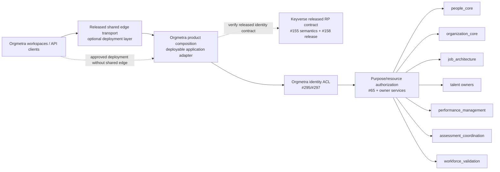

# Gateway composition boundary traceability

Verification date: 2026-09-21

Related issue: #432

Related Proposed ADR: `docs/adr/0432-deployable-orgmetra-gateway-composition-boundary.md`

## Protected-truth RED

Protected `develop@eb9757f8649aaad026a9865508d9aad50c1a7a4f` documents one buyer-visible Orgmetra Gateway and gives it API aggregation plus pre-handler Keyverse authentication responsibility. The executable protected repository still has no supported deployable product-composition application across independently versioned owner services. This document records design/acceptance traceability only; it does not convert that RED into shipped capability.

Draft #434 is the first executable canary under #432, but it is stacked on #340 and remains unprotected. It proves only a route-admission subset and carries no protected deployment/release credit.

## Fresh owner evidence

### Shared edge runtime

`ContextualWisdomLab/pingora-gateway` protected `main@f8b4c99b8e5d3de79af1ff0c00c0c8fd63b52991` has no published immutable GitHub Release.

Root PR #1 exact `38db1949354f5721dc0ecfeea395bcf958a64ace` remains Draft. Its current owner ledger records an unresolved PR-introduced `derivative 2.2.0 / RUSTSEC-2024-0388` supplier-security RED and no authenticated current-foundation central CodeQL verdict.

More importantly, the root candidate's `API_CONFIG_CONTRACT.md` v1 is **not** a multi-service Orgmetra composition contract:

- v1 requires exactly one upstream;
- route tables are explicitly outside the v1 contract;
- user-selected destinations, credentials, retry counts, static roots, WebSocket switches, and load-balancer policy are outside that contract;
- product authentication/authorization and Keyverse identity are outside the reusable edge owner.

The pingora-gateway pg-erd migration stack does contain characterized `backend` / `frontend` route composition, but its own owner text says the bounded pg-erd Admin Config **does not become a generic multi-route product policy language**. Its route/header/auth/business authority is specific to that migration path. Mutable migration branches or copied pg-erd source/config are therefore not an Orgmetra product-composition dependency.

This produces two independent gates:

1. shared edge transport is currently unreleased/security-nonterminal; and
2. even a future release of the current generic v1 contract would not, by itself, implement Orgmetra multi-owner routing/auth/composition.

### Identity and authorization

`ContextualWisdomLab/keyverse` protected `main@7d9151cd2da260e118020c938c7358e2ee75d541` has no published immutable consumer release. Keyverse #155 owns durable-versus-session-only subject-trust semantics. #158 owns the broader immutable OIDC relying-party release envelope and must reuse or fully supersede #155 rather than define parallel subject truth.

Orgmetra #295/#297 own durable subject-to-Person binding/consumer ACL. Orgmetra #65 and each domain owner retain purpose/resource authorization. Existing People and Job Analysis HTTP edges expose an injected authenticator/principal port rather than a released Keyverse verifier. Product composition may project a request principal over those contracts but cannot become a second identity, Person-binding, or authorization authority.

### Executable product-composition canary

Draft PR #434 is stacked on #340 so it does not become a competing Foundation-workflow writer. Current exact head is `9ad27d839a4684706561479c58eaeb51a9c4a7d9`; fresh compare against #340 exact `28f2bd28414e217f7e848ba86c0cfdbe97fd518f` remains ordinary-forward, with 71 commits / 13 changed files and all net changes confined to `services/product-composition-api/**`.

Current canary semantics are deliberately narrower than the final Gateway/product boundary:

- `OwnerApiRelease` requires service identity, immutable release version, exact OpenAPI digest, exact artifact digest, and the canonical Orgmetra GitHub Release namespace;
- all routes for one owner `service_id` within a generation must reference one exact `OwnerApiRelease`; the observed owner snapshot is keyed by `service_id`, so split release identities for one owner are rejected as intrinsically unsatisfiable;
- `CompositionRoute` contains route identity, canonical path/methods, exact owner release, an owner-bound logical service reference, and required/optional criticality only;
- `configuration_sha256` is derived from the canonical semantic route projection and is stable across route ordering;
- path templates that can select the same concrete request are rejected across different owners when their effective method authorities overlap; GET and HEAD are one collision authority while the actually declared method set remains canonical route material;
- complete `.` and `..` URI path segments are rejected before route admission so URI normalization cannot make a manifest route and a downstream selected path disagree;
- one OpenAPI path template cannot repeat the same template expression, so a route such as `/v1/tenants/{record_id}/people/{record_id}` fails before configuration hashing instead of depending on framework-specific parameter-map semantics;
- the composition contract has **no local retry class, idempotency mode, or concurrency mode**;
- `AdmissionReceipt` is canonical process-local structural evidence whose exact issued fields remain bound to the issued object; post-issuance field drift fails closed;
- admitted/unavailable receipt route IDs are emitted in deterministic `route_id` order, matching the contract's treatment of route tuple order as non-semantic;
- admission revalidates current nested owner/route/generation/config evidence before use rather than trusting constructor-time success, retained aliases, cached booleans, or reconstructed receipt-shaped data; and
- a canonically constructed `CompositionGeneration` is additionally bound to its original process-local `(schema_version, generation_id, config_sha256)` construction snapshot. Changing `generation_id`, or coherently changing route semantics and then recomputing/writing `config_sha256`, cannot silently turn the same constructed generation into a different semantic generation.

The canary's RED history matters to this ADR. Earlier REDs established that an arbitrary 64-hex config label could pass without binding route semantics; permissive release locators, overlapping route authority, duplicated retry-policy ownership, and overclaimed buyer readiness were possible; an issued receipt could be changed after issuance; a route could point to a different logical upstream than its released owner; nested route/release evidence could drift after construction; a self-consistent rewritten generation could pass use-time validation if the caller rewrote both the semantic graph and matching digest or rewrote `generation_id`; receipt route ordering could drift with a semantically irrelevant tuple reorder; GET and HEAD for the same selected-resource path could be split across different route owners; complete URI `.` dot-segments could be admitted even though URI normalization removes them; two routes for the same owner service could point at different exact release identities even though the observed owner snapshot can carry only one release for that `service_id`; and one route could repeat the same OpenAPI path-template expression even though OAS requires template-expression uniqueness within a path.

The latest executable ordinary-forward sequences include:

- `f7175e36d32034581cf05758b64256c06e7a3ea5` -> `105fa9a584c5aa9865c86082664411f922a84492` -> `d3e24da90bbd4b2c5e44f7acfaeb15225eff08a0` for generation-construction identity;
- `5bbd018750a49a2bfa4c28d62c1b091f493c77b2` -> `79279c211fd5912a30060991cb5054fac19daba1` -> `db251db2168bdea2e5af321e75952826a1f5a21b` for canonical receipt route ordering;
- `34a598ad2c60cd00b8c51b3be5a8abfd3b5b377f` -> `8a1e8854bb8e7c7a712e83dc9ef1e593095ebdfe` -> `bdedbda008746ecfac39895b16537c2c99a63165` for GET/HEAD selected-resource ownership;
- `4c8d195de1876d163dd115d82aaa9cc7f628d48f` -> `e8931bc9861cb2e01c68887660f1286bed3329b0` -> `8bdb2bb295ccf69d789c9c19771a42066e05b109` for URI dot-segment route identity;
- `b9777f698eb9ed5251cfca6ab9317552a3cf60b3` -> `ab35e5c3ea795161e6008a7cac3bd1b65784d321` -> `356fe9e9537b7e0585934a6432c40fed08487a5d` -> `51a1ad47025e5522aea65af01c97d1f4cef078c5` for one-release-per-owner-service coherence; and
- `acc7a471d7fe28baea0af4c63073a8853a57ef40` -> `bd43f474a6167e9af81293e00c949ba93d03e84e` -> `9ad27d839a4684706561479c58eaeb51a9c4a7d9` for repeated OpenAPI path-template expression rejection.

Earlier focused local figures on predecessor `cb32ba828...`—16 tests, 201/201 statements and 84/84 branches—are **predecessor evidence only** after later material source/test writes. Current exact `9ad27d83...` requires fresh exact-head hosted evidence; no predecessor coverage/Security/SAST/CodeQL result transfers to this head.

## Corrected Context Map

The protected product label “Orgmetra Gateway” is the buyer-facing boundary. Internally, generic edge transport and product composition have different owners. The composition application is an application adapter, not an HR bounded context.

## Ownership matrix

| Concern | Owner | Composition role | Forbidden behavior |
|---|---|---|---|
| Generic network/proxy transport, connection/TLS mechanics, bounded edge resources, drain | released shared edge owner | consume only supported released capabilities | copy mutable edge source; reinterpret a single-upstream contract as multi-service routing |
| Product route/admission generation | Orgmetra #432 implementation | select compatible released owner operations and bind a reproducible composition generation | put product route semantics into an unsupported edge config; reuse pg-erd migration routing as generic authority; rewrite one constructed generation into another meaning; split GET/HEAD selected-resource authority across owners; admit URI dot-segment aliases as distinct routes; repeat one OpenAPI template expression in a path; bind one owner service to multiple release identities in one generation |
| Identity provider / token issuance / canonical OIDC profile | Keyverse | consume released RP verifier/profile | issue credentials; broaden Keyverse with ad hoc HR claims |
| Durable subject trust | Keyverse #155, packaged by #158 | preserve exact released semantics | assume every syntactically valid `sub` is durably bindable |
| Durable subject-to-Person binding / consumer ACL | Orgmetra #295/#297 | reconstruct/revalidate owner evidence | mint Person truth in gateway/composition |
| Runtime actor/tenant projection | Orgmetra composition ACL constrained by #295/#297 | map verified identity to opaque request coordinates | implicit UUID cast; trust decoded-only claims |
| Purpose/resource authorization | Orgmetra #65 + domain owners | pass exact context; coarse early denial only | make scope/role/purpose self-authorizing |
| Person/Employment/Assignment | People | route and preserve owner semantics | query/write People tables |
| Organization/Position | Organization | route and preserve owner semantics | query/write Organization tables |
| Job/FJA/KSAO | Job Architecture | route and preserve owner semantics | copy ontology/job schema |
| Talent/selection | owning Talent context | route and preserve owner semantics | make employment decisions |
| Assessment assignment intent | assessment coordination | route and preserve owner semantics | own assessment execution/scoring/result truth |
| Scientific validity/fairness | Workforce Validation | preserve scientific state/errors | coerce pending/not-verifiable/non-convergence to success |
| Mutation idempotency/replay | owning domain service | forward exact owner-required coordinates and consume released owner replay semantics | create a second replay taxonomy/state or infer mutation safety locally |
| Optimistic concurrency | owning domain service | forward exact owner coordinate | create a gateway/composition-local version truth |
| Retry safety | released owner operation contract, constrained by HTTP semantics | deny by default unless the exact owner contract makes the attempted replay safe | store a composition-local `retry_class` or infer positive safety from HTTP method alone |

## Composition manifest semantics

A future executable `orgmetra_gateway_composition.v1` or equivalent must identify:

- Orgmetra product release and source provenance;
- product-composition application release/artifact digest;
- composition schema version, semantic config digest, immutable generation identity, and activation identity;
- shared edge release/artifact digest when deployed;
- Keyverse release/profile plus subject-trust contract identity;
- Orgmetra identity-ACL version/digest;
- stable `route_id`, canonical path/method set, owner service identity;
- released owner API/OpenAPI version and digest;
- immutable owner artifact/release coordinate sufficient to reconstruct the admitted operation;
- logical upstream service reference bound to that owner service;
- required coarse capability and authoritative tenant/actor/purpose locations; and
- required-versus-optional readiness criticality.

The config digest is computed from the canonical semantic projection; it is not an arbitrary caller label. A generation identifier cannot be reassigned to a different digest/semantic graph after canonical construction. One owner `service_id` maps to one exact released owner identity within the generation because the observed owner snapshot has one slot per service; simultaneous versions require an explicit later contract rather than implicit ambiguity. Owner idempotency, replay, concurrency, error, and retry semantics are **referenced through exact released owner evidence rather than copied into local manifest classifications**. Route method declarations remain exact contract material; only collision ownership treats GET and HEAD as one effective selected-resource authority. Complete `.` and `..` path segments are rejected rather than normalized into another manifest route identity, and each OpenAPI path-template expression appears at most once in one route.

A mutable branch, PR SHA, copied schema, floating image/tag, reachable endpoint, constructor-time success, self-consistent rewritten object graph, split owner release identity, dot-segment alias, repeated template expression, or reconstructed receipt-shaped value alone is not route authority.

## RED -> GREEN evidence map

| RED / risk | Required GREEN evidence | Owner lane |
|---|---|---|
| Architecture advertises Gateway but no deployable product composition exists | supported local + Kubernetes product-composition application bound to immutable identities | #432 implementation |
| shared edge has no immutable release | version/tag/artifact + SBOM/provenance/reproducibility/rollback | pingora-gateway owner stack |
| shared edge root has supplier-security RED | owner causal fix + current-head security/CodeQL gates | pingora-gateway owner stack |
| generic edge v1 has one upstream/no route tables | composition application remains explicit; do not claim edge config implements multi-owner product routing | #432 implementation |
| pg-erd migration router is treated as reusable product route authority | negative conformance rejects migration-specific/mutable route contract | #432 + pingora owner contract |
| Keyverse has no immutable RP release | released verifier/profile/fixtures + SBOM/provenance/rollback | Keyverse #155 -> #158 |
| decoded/unverified Keyverse claims are trusted | issuer/audience/signature/algorithm/time/JWKS verification before projection | Keyverse #158 + Orgmetra conformance |
| raw subject becomes durable Person truth | released evidence revalidated under #295/#297; forged/stale/cross-tenant/non-durable fails closed | #295/#297 |
| scope/role bypasses purpose/resource auth | #65/domain-owner authorization executes and denial survives end to end | #65 + owner + composition E2E |
| route exists without released owner API | admission rejects missing/floating/incompatible owner contract | #432/#434 implementation |
| OpenAPI/artifact/release coordinate differs from admitted contract | route unavailable; safe admission coordinate identifies mismatch | #432/#434 implementation |
| one owner service is assigned multiple exact release identities in one generation | generation construction and use-time revalidation reject split release/OpenAPI/artifact coordinates before admission | #432/#434 implementation |
| config digest is an unbound caller value | deterministic digest recomputed from canonical semantic route projection; mismatch rejected | #434 + final composition owner |
| generation identity or route semantics are rewritten after construction and the caller supplies a matching new digest | exact constructed schema/generation/config identity remains bound; activation/admission rejects any post-construction identity/digest drift and revalidates the nested semantic graph | #432/#434 + activation owner |
| overlapping path templates claim different owners under the same effective method authority, including a GET/HEAD split | parameter/static overlap and GET/HEAD selected-resource collision rejected before activation; declared method sets remain unchanged | #434 + HTTP composition E2E |
| a route template contains complete `.` or `..` URI path segments | reject before manifest hashing/admission so normalization cannot select another route identity | #434 + HTTP composition E2E |
| a route repeats one OpenAPI template expression | reject before configuration hashing/admission so framework parameter binding cannot collapse distinct semantic coordinates | #434 + HTTP composition E2E |
| logical upstream names a different service from the admitted owner release | owner-bound upstream invariant rejects the route before admission | #434 + HTTP composition E2E |
| issued admission receipt fields are changed after issuance | canonical process-local field binding rejects mutated receipt evidence | #434; durable activation must independently re-evaluate |
| semantically equivalent route tuples produce different receipt ordering | deterministic `route_id` ordering for admitted/unavailable receipt fields | #434 + activation evidence |
| local retry/idempotency/concurrency taxonomy substitutes for owner truth | no local retry class/replay state; exact released owner semantics control permitted replay | #432/#434 + owner contract |
| route admission is represented as buyer readiness | admission receipt remains structural only; buyer readiness requires identity/ACL/runtime/dependency evidence | #432 implementation + operability |
| token/path/query/header identity coordinates contradict | deterministic fail closed; no precedence guess | composition + identity ACL |
| composition changes `Idempotency-Key` or owns replay state | exact key reaches owner; no composition replay fact exists | composition E2E + owner API |
| ambiguous post-commit failure causes duplicate mutation | no fresh mutation; only owner-declared same-key replay | fault-injection E2E |
| owner conflict/denial/unavailable/scientific non-success becomes success | exact status/state/error identity preserved | composition E2E |
| partial config generation activates | generation-atomic validation/activation against immutable identity | operability test |
| cancellation/timeout leaks tasks/connections | bounded cleanup evidence across every deployed layer | runtime E2E |
| composition reaches peer DB | credentials/network/code prohibit cross-service SQL | security test |
| latency benchmark bypasses edge/composition/owner DB | full deployed path measured with exact deployment evidence | performance acceptance |

## Identity projection invariants

- #155 decides durable subject-correlation eligibility; #158 cannot silently broaden it.
- #295/#297 remain the durable subject-binding path; request authentication never creates Person authority.
- verified Keyverse `sub` may map only to a namespaced opaque runtime actor reference through a versioned ACL.
- `org` / `workspace` are resolved through explicit Orgmetra mapping; they are not cast directly to `tenant_record_id`.
- only admitted scope semantics become coarse operation capabilities; #65/domain-owner authorization still evaluates business purpose/resource.
- caller-controlled tenant/actor/purpose coordinates must agree with authenticated/projected coordinates for the route or fail closed.
- missing/incompatible verifier, JWKS, subject-trust contract, ACL, or owner route is failure, never anonymous or permissive fallback.

## Retry and concurrency interleavings

Acceptance must include:

1. owner commits mutation but the response is lost;
2. client retries with the same `Idempotency-Key` only if the exact released owner operation contract authorizes that replay;
3. owner returns the original committed identity under its replay contract;
4. product composition preserves that result without inventing another mutation identity or retry classification.

RFC 9110 method semantics are a protocol constraint, not sufficient evidence that an Orgmetra operation is safe to replay automatically. A route without an exact released owner replay guarantee receives no automatic mutation retry, and product composition has no local `retry_class` from which to infer one. Generation changes, owner-contract changes during activation, request cancellation racing a late owner response, JWKS refresh races, and identity-ACL version changes are all tested so one request never mixes incompatible generations.

## Performance evidence

The measured buyer path includes every actual deployment layer:

`k6/client -> [shared edge, if deployed] -> Orgmetra product composition -> owner HTTP -> PostgreSQL -> owner -> composition -> [edge] -> client`

For designated ordinary paths, p95 <= 20 ms. Evidence records concurrency/sample/duration, deployment identity, right-to-use dataset, PostgreSQL/schema/index/RLS state, auth/audit state, Keyverse/ACL identity, composition release/config digest/generation identity, optional edge release/artifact digest, owner API/OpenAPI digest, hardware/runtime, and observation timestamps.

Report edge, composition, and owner execution costs separately. Do not discard slow requests, shrink samples to pass, disable auth/audit, use a router stub, or claim a warm-cache subset as the whole operational path.

## Deployment and recovery evidence

GREEN requires:

- Podman/Colima local composition with production-equivalent service boundaries;
- supported Kubernetes packaging with immutable artifact/image identities;
- no cross-schema gateway/composition DB credentials;
- separate edge liveness, composition liveness, config validity, identity-contract admission, route admission, and product readiness;
- bounded drain across edge/composition/owner layers actually deployed;
- immutable generation activation and rollback with construction/config identity plus owner-contract compatibility revalidation;
- logs/metrics/traces that exclude credentials, restricted HR payloads, stack traces in client responses, and unbounded tenant/person labels.

## Single-writer handoff

- #432 remains the executable product-composition gap owner. Draft #434 is its first bounded implementation slice, not a new owner issue.
- #433 owns this Proposed ADR/traceability/doctoring decision only. This traceability source incorporates receipt-field, owner/upstream, one-release-per-owner-service, use-time nested-revalidation, generation-construction identity, canonical receipt ordering, GET/HEAD selected-resource authority, URI dot-segment route identity, and OpenAPI path-template-expression uniqueness; ADR 0432 must remain aligned before Accepted consideration.
- #340 remains the Foundation-workflow prerequisite/owner; #434 is stacked on it precisely to avoid a parallel Foundation workflow writer.
- #51 remains canonical writer for protected `ARCHITECTURE.md`, TRD, API, SECURITY, THREAT_MODEL, TEST_STRATEGY, OPERABILITY, repository TRACEABILITY, and deterministic manifest reconciliation.
- #100 remains sole writer for `docs/product-technical-gap-baseline.md`; `API-01` stays Planned while #434 is unprotected and non-deployable.
- Keyverse #155/#158, Orgmetra #295/#297/#65, domain API owners, and pingora-gateway keep their existing authority.

No source in this Proposed lane or Draft #434 grants protected integration, release, deployment, buyer-readiness, or performance credit.
