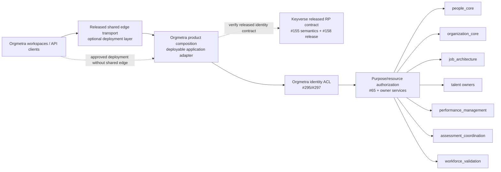

# Gateway composition boundary traceability

Verification date: 2026-09-21

Related issue: #432

Related Proposed ADR: `docs/adr/0432-deployable-orgmetra-gateway-composition-boundary.md`

## Protected-truth RED

Protected `develop@eb9757f8649aaad026a9865508d9aad50c1a7a4f` documents one buyer-visible Orgmetra Gateway and assigns API aggregation plus pre-handler Keyverse authentication responsibility to that boundary. The protected executable repository still has no supported deployable product-composition application across independently versioned owner services. This document is design/acceptance traceability only and does not turn that RED into shipped capability.

Draft #434 is the first bounded executable canary under #432. It is stacked on #340 and remains unprotected, so it carries no deployment or release credit.

## Fresh owner evidence

### Shared edge runtime

`ContextualWisdomLab/pingora-gateway` protected `main@f8b4c99b8e5d3de79af1ff0c00c0c8fd63b52991` has no published immutable GitHub Release. Its generic v1 owner contract requires one upstream and excludes product route tables, user-selected destinations, credentials, retry counts, Keyverse identity, and product authentication/authorization. The pg-erd multi-route path is migration-bounded and explicitly not a generic product-policy language.

Two independent gates therefore remain: the shared edge is unreleased/security-nonterminal, and even a future release of its current generic v1 contract would not implement Orgmetra multi-owner product composition.

### Identity and authorization

`ContextualWisdomLab/keyverse` protected `main@7d9151cd2da260e118020c938c7358e2ee75d541` has no published immutable consumer release. Keyverse #155 owns durable subject-trust semantics and #158 the broader immutable OIDC relying-party release envelope. Orgmetra #295/#297 own durable subject-to-Person binding/consumer ACL. Orgmetra #65 and domain owners retain purpose/resource authorization. Product composition may project one verified runtime principal but cannot become a second identity, Person-binding, or authorization authority.

### Executable product-composition canary

Draft #434 exact authority is `bf90bbfbc2eef88d57fd30286b41a86f483a3fa1`, stacked on #340 exact `28f2bd28414e217f7e848ba86c0cfdbe97fd518f`, 74 ahead / 0 behind with 13 changed files, all net changes confined to `services/product-composition-api/**`.

The current canary proves only structural admission invariants:

- `OwnerApiRelease` binds service identity, immutable release version, OpenAPI digest, artifact digest, and the canonical Orgmetra GitHub Release namespace;
- one owner `service_id` maps to one exact release identity per generation;
- logical `service://` upstream identity must agree with released owner service identity;
- `configuration_sha256` is derived from canonical semantic route material and route tuple order is non-semantic;
- invalid per-route and cross-route material is rejected before configuration identity is minted;
- complete URI `.` / `..` segments are rejected before route identity;
- one OpenAPI path cannot repeat the same template expression;
- OpenAPI paths with the same hierarchy but different placeholder names are one path identity regardless of HTTP method; one hierarchy therefore maps to one exact template string;
- distinct HTTP methods may share that same exact template string when operation ownership is otherwise valid;
- effective-method authority is checked separately from path-key identity, with GET and HEAD treated as one selected-resource collision authority while the declared method set remains exact contract material;
- the route model has no composition-local retry class, idempotency mode, or concurrency mode;
- `AdmissionReceipt` is canonical process-local structural evidence whose issued fields remain bound to the issued object;
- receipt admitted/unavailable route IDs are deterministic by `route_id`;
- admission revalidates nested owner/route/generation/config evidence immediately before use; and
- a canonical `CompositionGeneration` remains bound to its process-local construction identity while live generation-ID aliasing to another configuration fails closed.

Process-local integrity is not durable allocation, activation, authorization, or release evidence. Production activation/rollback still needs immutable durable generation/configuration/deployment authority that rejects historical ID reassignment across process lifetimes.

## Latest executable finding and repair

The latest self-review separated two concepts that the architecture text had previously conflated.

OpenAPI Specification 3.2.1 Section 4.8.1 defines templated paths with the same hierarchy but different template names as identical and says they MUST NOT coexist. Thus `GET /v1/people/{person_record_id}` and `PUT /v1/people/{worker_record_id}` cannot be two path keys merely because their methods differ. Path identity is decided before operation-method collision.

The executable ordinary-forward sequence is:

- `2b4f2211a2e332058bec31af11474d3937899855` — regression-first contract rejects same-hierarchy/different-template-name aliases even under disjoint methods and preserves a positive control for distinct methods on the same exact template string;
- `2c7bfcf75ec2d353d52ed86cbcd74dba5ddae3ea` — `_validate_route_set(...)` derives a parameter-name-independent hierarchy and requires one exact template identity per hierarchy before configuration hashing; and
- `bf90bbfbc2eef88d57fd30286b41a86f483a3fa1` — documents the distinction in the executable canary.

Earlier retained repair sequences include generation-construction identity, canonical receipt ordering, GET/HEAD authority, URI dot-segment rejection, one-release-per-owner-service coherence, foreign-release attribution, pre-hash route-set validation, live generation lineage, and repeated single-path template-expression rejection. Earlier focused local figures at predecessor `cb32ba828...` are predecessor evidence only; material source/test changes followed.

## Corrected context map

The protected product label “Orgmetra Gateway” remains the buyer-facing boundary. Internally, generic edge transport and product composition have different owners. Composition is an application adapter, not an HR bounded context.

## Ownership matrix

| Concern | Owner | Composition role | Forbidden behavior |
|---|---|---|---|
| Generic network/proxy/TLS/drain | released shared-edge owner | consume supported released capability | copy mutable edge source or reinterpret single-upstream config as product routing |
| Product route/admission generation | Orgmetra #432 | bind reproducible admitted owner operations | reuse pg-erd migration policy; rewrite generation meaning; same-hierarchy path aliases with different placeholder names; split GET/HEAD authority; dot-segment aliases; repeated template expressions; split owner release identities |
| Identity issuer/profile | Keyverse | consume released RP verifier/profile | issue credentials or broaden Keyverse with HR claims |
| Durable subject trust | Keyverse #155 packaged by #158 | preserve released semantics | assume every syntactically valid `sub` is durably bindable |
| Durable subject-to-Person binding / ACL | Orgmetra #295/#297 | consume/revalidate evidence | mint Person truth in composition |
| Runtime actor/tenant projection | Orgmetra composition constrained by #295/#297 | map verified identity to request coordinates | implicit UUID cast or decoded-only trust |
| Purpose/resource authorization | Orgmetra #65 + domain owners | propagate exact context; coarse early denial only | make role/scope/purpose self-authorizing |
| Person/Employment/Assignment | People | route and preserve owner semantics | query/write People tables |
| Organization/Position | Organization | route and preserve owner semantics | query/write Organization tables |
| Job/FJA/KSAO | Job Architecture | route and preserve owner semantics | copy ontology/job schema |
| Talent/selection | owning Talent context | route and preserve owner semantics | make employment decisions |
| Assessment assignment intent | assessment coordination | route and preserve owner semantics | own execution/scoring/result truth |
| Scientific validity/fairness | Workforce Validation | preserve scientific states/errors | coerce pending/not-verifiable/non-convergence to success |
| Mutation idempotency/replay | owning domain service | forward owner coordinates and consume released replay semantics | invent a second replay taxonomy/state |
| Optimistic concurrency | owning domain service | forward exact owner coordinate | create composition-local version truth |
| Retry safety | released owner operation contract | deny by default unless exact owner contract authorizes replay | infer positive safety from method alone |

## Composition manifest semantics

A future executable `orgmetra_gateway_composition.v1` or equivalent identifies product/composition release provenance, schema/config/generation/activation identity, optional shared-edge release, Keyverse release/profile, Orgmetra identity-ACL version, stable route identity, exact path and method set, exact owner API/OpenAPI/artifact/release coordinates, owner-bound logical upstream, coarse capability, authoritative tenant/actor/purpose locations, and required/optional criticality.

Configuration digest is computed from canonical semantic projection. A generation identifier cannot be reassigned to a different semantic graph. One owner service maps to one exact owner release per generation. Owner idempotency/replay/concurrency/error/retry semantics are referenced through released owner evidence rather than copied.

Path identity and method authority are separate:

- OpenAPI same-hierarchy templates with different placeholder names are one path identity and cannot coexist, even under disjoint methods;
- distinct methods may share the same exact template string;
- after path identity is valid, effective-method collision is evaluated independently, with GET/HEAD sharing one selected-resource collision authority;
- dot-segments are rejected rather than normalized; and
- repeated template expressions in one path are rejected.

A mutable branch, PR SHA, copied schema, floating tag, reachable endpoint, constructor success, self-consistent rewritten object graph, split owner release identity, path alias, or receipt-shaped value alone is not route authority.

## RED -> GREEN evidence map

| RED / risk | Required GREEN evidence | Owner lane |
|---|---|---|
| Gateway documented but no deployable composition | supported local + Kubernetes composition bound to immutable identities | #432 |
| shared edge unreleased or wrong contract | owner immutable release + supported capability | pingora-gateway owner |
| Keyverse RP consumer unreleased | released verifier/profile/fixtures + provenance/rollback | Keyverse #155/#158 |
| decoded/unverified identity trusted | issuer/audience/signature/algorithm/time/JWKS verification before projection | Keyverse + Orgmetra conformance |
| raw subject becomes Person truth | #295/#297 released binding evidence; forged/stale/cross-tenant fails closed | #295/#297 |
| scope/role bypasses purpose/resource auth | #65/domain-owner denial survives E2E | #65 + domain owner + composition |
| route lacks released owner API | missing/floating/incompatible owner contract rejected | #432/#434 |
| owner release coordinate mismatches | route unavailable with safe mismatch evidence | #432/#434 |
| one service has multiple release identities | reject before admission and on use-time revalidation | #432/#434 |
| config digest is caller label | recompute deterministic digest from canonical route material | #434 |
| generation meaning rewritten | construction identity and use-time graph revalidation reject drift | #432/#434 + activation |
| same hierarchy uses different placeholder names under any methods | reject before hashing; preserve positive control for distinct methods on one exact template | #434 + HTTP E2E |
| overlapping routes split one effective method authority including GET/HEAD | reject before activation; keep declared method sets unchanged | #434 + HTTP E2E |
| URI dot segment admitted | reject before hashing/admission | #434 + HTTP E2E |
| repeated template expression admitted | reject before hashing/admission | #434 + HTTP E2E |
| logical upstream disagrees with owner release | owner-bound upstream invariant rejects route | #434 + HTTP E2E |
| receipt fields drift or stale source graph is trusted | canonical field binding plus current source-graph revalidation | #434; durable activation independent |
| tuple ordering changes receipt evidence | deterministic route-ID ordering | #434 + activation evidence |
| local retry/idempotency/concurrency taxonomy substitutes for owner truth | no local replay taxonomy; exact owner contract controls replay | #432/#434 + owner |
| route admission is presented as buyer readiness | readiness also requires identity/ACL/runtime/dependency evidence | #432 operability |
| contradictory tenant/actor/purpose coordinates | deterministic fail closed | composition + identity ACL |
| ambiguous post-commit failure duplicates mutation | no fresh mutation; only owner-declared same-key replay | fault E2E |
| owner denial/scientific non-success becomes success | preserve exact status/state/error identity | composition E2E |
| partial/stale configuration activates | generation-atomic activation against immutable identity | operability |
| cancellation/timeout leaks resources | bounded cleanup across deployed layers | runtime E2E |
| composition reaches peer DB | credentials/network/code prohibit cross-service SQL | security |
| latency benchmark bypasses deployed layer or DB | full deployed path measured | performance acceptance |

## Identity projection and replay invariants

#155 decides durable subject-correlation eligibility; #158 cannot silently broaden it. #295/#297 remain the durable subject-binding path. Verified Keyverse `sub` maps only to an opaque namespaced actor reference through a versioned ACL. `org`/`workspace` require explicit Orgmetra mapping. #65/domain owners still evaluate business purpose/resource. Missing verifier/JWKS/ACL/owner evidence is failure, never permissive fallback.

Product composition has no local replay truth. If an owner commits a mutation but the response is lost, same-key replay occurs only when the exact released owner operation contract authorizes it; the owner returns the original committed identity and composition preserves it. HTTP idempotency semantics constrain the protocol but do not prove application replay safety.

## Performance evidence

The measured buyer path is:

`k6/client -> [shared edge if deployed] -> Orgmetra composition -> owner HTTP -> PostgreSQL -> owner -> composition -> [edge] -> client`

For designated ordinary paths p95 <= 20 ms. Evidence records load shape, deployment identity, right-to-use dataset, PostgreSQL/schema/index/RLS state, auth/audit state, identity/ACL coordinates, composition release/config/generation identity, optional edge release, owner API/OpenAPI identity, hardware/runtime, and timestamps. Slow requests are not discarded, samples are not shrunk to pass, and auth/audit/database layers are not skipped.

## Deployment and recovery evidence

GREEN requires production-equivalent Podman/Colima boundaries, supported Kubernetes packaging, immutable artifact/image identities, no cross-schema composition credentials, separate liveness/config/identity/route/readiness signals, bounded drain, immutable generation activation/rollback with owner compatibility revalidation, and logs/metrics/traces that exclude credentials/restricted HR payloads and unbounded sensitive labels.

## Single-writer handoff

- #432 remains the executable product-composition gap owner; #434 is its bounded first slice.
- #433 owns this Proposed ADR/traceability/doctoring lane. This source is now current through same-hierarchy OpenAPI path-key identity independent of HTTP method, as well as earlier receipt, owner/upstream, release-coherence, use-time revalidation, generation identity, receipt ordering, GET/HEAD, URI dot-segment, and repeated-expression findings.
- #340 remains the Foundation prerequisite/owner; #434 remains stacked on it to avoid a parallel Foundation writer.
- #51 remains canonical writer for protected ARCHITECTURE/TRD/API/SECURITY/THREAT_MODEL/TEST_STRATEGY/OPERABILITY/TRACEABILITY and manifest reconciliation after architecture admission.
- #100 remains sole writer for `docs/product-technical-gap-baseline.md`; `API-01` stays Planned while #434 is unprotected and non-deployable.
- Keyverse #155/#158, Orgmetra #295/#297/#65, domain API owners, and pingora-gateway retain their authority.

No source in this Proposed lane or Draft #434 grants protected integration, release, deployment, buyer-readiness, or performance credit.
