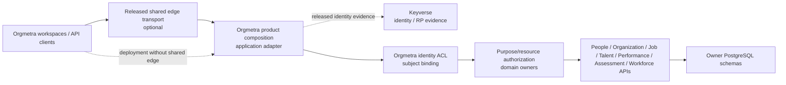

# Gateway composition boundary traceability

Verification date: 2026-09-24

Related issue: #432

Related Proposed ADR: `docs/adr/0432-deployable-orgmetra-gateway-composition-boundary.md`

## Protected-truth RED

Protected `develop@eb9757f8649aaad026a9865508d9aad50c1a7a4f` still documents one buyer-visible Orgmetra Gateway while protected executable truth has no supported deployable product-composition application across independently versioned owner services. Protected `docs/API_CONTRACT.md`, `docs/TRD.md`, `schemas/openapi.yaml`, and Foundation validation retain OpenAPI 3.2.0. This file records design and acceptance evidence only; Draft implementation does not become shipped truth.

`API-01` therefore remains Planned. #100 remains the only writer for `docs/product-technical-gap-baseline.md`, and #51 remains the protected architecture/technical-document reconciliation owner after architecture admission.

## Current executable stack

| Layer | Owner | Exact candidate | Current evidence | Not yet proved |
|---|---|---|---|---|
| Process-local route/generation admission | #434 | `68bdf2d984ca7686219c335a85a6574195675cbe` | canonical route/config identity, bounded OpenAPI path authority, nested construction/use-time integrity | durable generation/deployment authority, HTTP host, released owner evidence |
| Durable generation/configuration | #436 | `30d89fa8f4ba95d7ddb84dde8e3b7e5faebf0343` | normalized reconstructable generation material, non-reassignable `generation_id`, append-only registry, atomic hostile-search-path-safe 0018 publication | deployment authorization/recovery, identity/ACL release evidence |
| Durable activation/recovery/currentness | #437 | `a09d6fb928e0272673b82ef7353ed83213aa994d` | 0019→0025 authority, DB-clock freshness, durable recovery attestation, request-time currentness, typed serving expiry vs integrity failure | protected exact-head GREEN, immutable external production releases, deployable owner dispatch |
| Request selection | #438 | `6cd7a9081696c29fd3ce43a9f776fccfbf9ecaab` | declared Path Item/method preselection before currentness, stable `route_id`, concrete-before-template authority | authenticated principal/purpose context, owner HTTP dispatch |
| Raw ASGI request target | #439 | `dbee7dcd6ce641e23fe93dcc59b643c066eed526` | mandatory raw/decoded identity checks and fail-closed alias rejection before route authority | complete ASGI application and deployment lifecycle |
| HTTP method/error projection | #440 | `0050f14701ea92fd85a2691a280d29c46a97b63b` | 400/501/405/503 separation, current `Allow`, GET-backed HEAD, RFC 9457 problem emission | owner success response and end-to-end owner semantics |
| Typed serving projection | #442 | `9bbb792ef43fca8b08684f4f55a8bfe65e1120da` | only `ActivationConflictError` becomes route unavailability; authorization/integrity failure remains unwrapped | canonical exact-tree execution |
| ASGI request-body/receive | #443 | `728f07a8c86f92bbf33586f2a8007da9f31f5e06` | byte/event work bounds, event schema, disconnect, capability-shape vs runtime-failure separation | host integration and cleanup under real traffic |
| ASGI response-event/send | #444 | `e1af671deeeec682dffdf809cb8579dcc4d439da` | core event direction/schema, status 100..599, header safety, trailer fail-closed, send lifecycle | scope-aware extensions/trailers and complete host |
| Complete non-streaming response | #446 | `7954f5bf606584ddb5bbcd29e1b64e49041b9409` | prevalidate start/body before send, no-content semantics, `Content-Length`, transfer-coding ownership, mutable-header detachment | canonical runtime GREEN, owner success dispatch, deployed buyer-path SLO |

#434 is stacked on #340 exact `28f2bd28414e217f7e848ba86c0cfdbe97fd518f`. The remainder is an ordinary-forward implementation chain. Every layer remains Draft/unprotected. Source evidence is not release authority.

#440/#442/#443/#444/#446 add no SQL. PostgreSQL lineage remains **0018→0025**.

## Ownership map

Product composition is an application adapter, not another HR bounded context. It owns no Person, Employment, Assignment, Organization, Position, Job Architecture/FJA/KSAO, Talent, Assessment, Performance, or Workforce scientific truth. It does not query owner application tables. Keyverse retains credential/identity authority; Orgmetra identity/ACL owners retain subject binding; domain owners retain purpose/resource authorization, idempotency, concurrency, retry/replay semantics, errors, and scientific states.

## Admission authority — #434

Current #434 exact is `68bdf2d984ca7686219c335a85a6574195675cbe`. Relevant invariants include:

- exact owner release/OpenAPI/artifact/repository attribution and owner-bound logical upstream;
- one exact release identity per owner `service_id` in one generation;
- one exact owner release per exact Path Item in the bounded product profile;
- deterministic configuration digest over canonical route material;
- fail-closed canonical owner/route/generation identifiers and path-template expressions;
- parameter-name-independent OpenAPI path identity;
- deterministic same-owner concrete-before-template precedence only when owner release and declared method set agree;
- cross-owner concrete/template overlap and ambiguous templated overlap rejection;
- operation authority separated from path matching, with GET/HEAD sharing selected-resource collision authority while declared methods remain exact material;
- URI dot-segment and repeated-template-expression rejection; and
- process-local construction snapshots and use-time revalidation for owner-release, route, generation, and admission evidence where defined.

A process-local snapshot or receipt proves only that one live object/graph has not been reinterpreted. It is not cross-process release or activation authority.

## Durable generation/configuration authority — #436 / 0018

#436 exact `30d89fa8f4ba95d7ddb84dde8e3b7e5faebf0343` projects one admitted generation into normalized generation, owner-release, route, and route-method rows through `PostgresGenerationRegistry`.

Required properties are:

- one `generation_id` cannot be reassigned to different semantic material;
- exact re-registration is idempotent only for the complete identical durable record set;
- generation and children persist atomically;
- reload reconstructs fresh canonical #434 values and recomputes `config_sha256`;
- missing, split, or forged route/release material cannot be accepted merely because a stored digest matches a caller value;
- UPDATE, DELETE, and TRUNCATE cannot rewrite registry history; and
- caller-controlled migration `search_path` cannot redirect generation authority relations, foreign-key targets, or guard functions away from reviewed `public` objects.

The 0018 schema and its mutation guards publish in one transaction. This is durable configuration authority only; it does not absorb deployment activation/recovery semantics.

## Durable activation/recovery/currentness authority — #437 / 0019–0025

Current ordered migration chain is **0018 -> 0019 -> 0020 -> 0021 -> 0022 -> 0023 -> 0024 -> 0025**.

- **0019** introduces deployment/environment identity, external authority evidence, exact owner-operation observations, and append-only activation events in trusted `public` objects.
- **0020** refuses predecessor NULL-evidence activation history and promotes evidence-bound authority under a writer fence.
- **0021** rejects future-dated/already-stale owner observations against PostgreSQL wall clock and fences the upgrade scan/guard transition.
- **0022** persists append-only fresh recovery attestations bound to exact activation sequence, generation, and `authorization_action='recover'` evidence.
- **0023** makes direct activation/recovery writers acquire the same deployment row before lineage/evidence validation.
- **0024** verifies critical public trigger functions and rebinds all 16 activation/recovery triggers to explicit trusted function identities.
- **0025** anchors all activation/recovery child relation ownership to the parent `public.product_composition_generation` authority and rejects both split and uniformly foreign ownership.

The full-chain hostile-search-path contract executes 0018→0025 from a caller-controlled decoy schema and requires all composition authority relations and trigger functions to remain bound to reviewed `public` identities.

`recover_active_route_snapshot()` is the startup/reload acquisition path. `current_route_ids_for_snapshot()` is the request-time database linearization point. Expected otherwise-valid recovery-evidence expiry is `ServingEvidenceExpiredError`, an `ActivationConflictError`; database-clock rewind, malformed durable state, deployment/snapshot retargeting and other authorization/integrity failures remain `ActivationAuthorizationError`. Descendants therefore never inspect exception text to decide whether a route is merely unavailable.

## Request selection and HTTP projection — #438/#439/#440/#442

#438 selects the declared Path Item and method before crossing PostgreSQL currentness. Unknown declared paths and undeclared methods do not acquire authority by falling through to a broader template or by touching currentness first. The selected route identity is stable before the currentness lookup.

#439 preserves the raw ASGI request target as evidence. Percent-encoded aliases, fragments, non-ASCII/malformed transport material, URI dot-segments and raw/decoded disagreement fail closed before canonical route selection. Normalization is not allowed to create a new route identity.

#440 keeps four HTTP decisions separate:

- malformed method syntax → 400;
- syntactically valid method outside the supported composition profile → 501;
- method not allowed by the selected currently serviceable resource → 405;
- selected method without current positive serviceability → 503.

`Allow` is derived from current selected-resource authority and can legitimately be empty while the resource is temporarily disabled. GET-backed HEAD shares selected-resource representation authority while HEAD sends no response content. RFC 9457 problem output excludes internal exception detail.

#442 projects only typed serving conflicts into `CompositionRouteUnavailableError`. `ActivationAuthorizationError` is deliberately not wrapped, preserving security/integrity failure identity.

## ASGI request-body and receive lifecycle — #443

The request-body owner independently bounds retained bytes and receive-event work. That prevents both oversized bodies and empty/tiny-chunk event amplification. It validates `http.request` event shape/defaults, treats `http.disconnect` as a distinct peer-lifecycle signal, and propagates cancellation.

A non-callable receive capability or a normal non-awaitable return is demonstrably malformed and fails closed locally. An exception raised while invoking a callable, or while awaiting the returned awaitable, is not automatically a configuration defect; it remains caller/server lifecycle authority. This aligns the inbound boundary with outbound send semantics.

## ASGI response-event/send lifecycle — #444

#444 owns caller-side core HTTP response-event validation before calling the ASGI server:

- only `http.response.start` and `http.response.body` are admitted by the current core profile;
- status is 100..599;
- response headers are byte pairs whose names are non-empty lowercase RFC 9110 tokens;
- invalid control octets in field values are rejected;
- `trailers=True` fails closed until a separate scope-aware owner negotiates and completes trailer emission; and
- `send` is checked for callable/awaitable shape without laundering invocation/await-side runtime failures, closed-connection `OSError`, or cancellation into a local response-shape error.

Response-send errors remain outside the request/routing error hierarchy. A broken outbound response cannot recursively become another problem response.

## Complete response sequencing/framing — #446

#446 is the current implementation leaf at exact `7954f5bf606584ddb5bbcd29e1b64e49041b9409`. For complete non-streaming responses it validates response-start metadata and the terminal body before the first irreversible `send()`.

The owner additionally:

- derives empty wire content for HEAD and statuses 204, 205 and 304;
- validates explicit `Content-Length` against selected representation/no-content semantics and rejects duplicates/non-decimal/mismatch;
- rejects application-supplied `Transfer-Encoding`, leaving outbound transfer coding to the ASGI protocol server;
- detaches validated header pairs into owned immutable `(bytes, bytes)` tuples before the first transport await, so caller mutation cannot change wire metadata after validation; and
- preserves transport/runtime exceptions rather than translating a partial response into a second HTTP response.

The latest review-only repair on #446 fixed RUF043 match patterns and documented all nested async test helpers so the diff-scoped docstring gate no longer reports the earlier 58.54% result. That repair changes no production behavior.

## External authority boundary

Production positive activation/recovery still requires actual immutable released evidence, not release-shaped fixtures:

- Keyverse released consumer/RP evidence for verified identity;
- immutable Orgmetra subject-binding / ACL / purpose-policy evidence;
- exact released owner API/OpenAPI/artifact coordinates;
- one fresh owner-operation observation for every admitted route/path/method/release coordinate; and
- exact authorization action plus durable state sequence.

Composition may deny early but may not create Person truth or replace owner authorization. Missing, duplicate, stale, future-dated, wrong-generation, wrong-action, wrong-state, wrong-owner, or incomplete operation evidence fails closed.

## Canonical execution dependency and current RCA

Canonical package execution is still missing for the current leaf for a structural reason, not because a current #446 workflow is merely waiting.

Protected `.github/workflows/foundation-ci.yml` triggers repository Foundation only for `pull_request` events whose base is `develop`. #446 is correctly stacked on #444, so no PR-triggered Foundation run is created for exact `7954f5bf606584ddb5bbcd29e1b64e49041b9409`. The same protected workflow also hard-codes service execution for `services/job-analysis-api` and `services/people-api`; it does not discover or execute `services/product-composition-api` at all.

#260 is the canonical repository-level service discovery/runtime compatibility owner. #261 is the installed-wheel successor that removes source-tree `PYTHONPATH` as packaging acceptance evidence, binds exact built artifacts and dependency/runtime closure, and keeps 100% coverage. #311 owns owner-neutral PostgreSQL contract discovery/execution. #311 itself remains stacked on #259 and therefore also has no protected-base PR-triggered Foundation admission under the current `pull_request.branches: [develop]` filter.

This is a Foundation-owner repair path. #446 must not add a feature-local quality workflow, copy mutable #259/#260/#261/#311 source, temporarily retarget its base, synthesize checks, or treat manual `PYTHONPATH` execution as canonical evidence. The Foundation capabilities integrate through their normal owner path first; the composition stack then ordinary-forward adopts protected truth and runs from one unchanged exact candidate tree.

Current exact #446 also has no submitted qualifying `APPROVED` review. Its source mergeability and bot statuses are not runtime GREEN.

## Current exact acceptance set

After the canonical Foundation owners integrate, one unchanged composition candidate must execute:

- `services/product-composition-api` under its truthful declared interpreter/dependency closure and installed-artifact contract;
- exact package pytest configuration and 100% owned statement/branch/docstring/edge coverage where tooling exposes it;
- request selection, raw request-target, HTTP method/currentness/GET-HEAD semantics, bounded receive lifecycle, response-event/send lifecycle, and complete response/framing tests together;
- migration order 0018→0019→0020→0021→0022→0023→0024→0025;
- generation/full-chain hostile-search-path contracts;
- 0020/0021 hostile upgrade contracts;
- activation/recovery deployment-row serialization;
- recovery-attestation and request-time currentness positive/negative contracts;
- trigger-function and relation-owner provenance, including uniform foreign child-owner drift;
- runtime-capability integrity and recovery commit-boundary regression; and
- expected serving expiry distinct from clock/integrity/authorization failure.

A predecessor schema/head, source-tree `PYTHONPATH`, feature-local workflow, mergeability result, or bot status cannot substitute for this evidence.

## RED -> GREEN evidence map

| RED / risk | Required GREEN evidence | Owner |
|---|---|---|
| documented Gateway but no deployable composition | supported authenticated HTTP/Kubernetes composition bound to immutable identities | #432 |
| owner route lacks immutable release/operation authority | released OpenAPI/artifact + operation conformance, fail closed when absent | #432/#434 + owner |
| process-local value retargeted after construction | construction/use-time integrity rejects retarget; new meaning requires new value | #434 |
| generation registry publishes incompletely or under hostile namespace | atomic 0018 + explicit trusted schema + hostile-search-path contract | #436 / 0018 |
| same generation ID acquires new durable meaning | normalized registry rejects reassignment and reconstructs digest from durable material | #436 |
| activation registry becomes visible before guards | 0019 table/function/guard DDL publishes in one transaction | #437 / 0019 |
| activation event has no external authority | current schema requires exact evidence bundle and complete operation observations | #437 / 0020 |
| predecessor writer crosses authority promotion | fenced 0020 upgrade + hostile concurrent writer contract | #437 / 0020 |
| owner observation claims future/stale knowledge | Python validation plus PostgreSQL wall-clock rejection | #437 / 0021 |
| restart is authorized only in memory | append-only recovery attestation bound to sequence/generation/fresh evidence | #437 / 0022 |
| direct SQL bypasses product serialization | activation/recovery INSERTs lock the same deployment row | #437 / 0023 |
| migration `search_path` binds hostile trigger function | explicit public trigger provenance and hostile decoy contract | #437 / 0024 |
| child relation ownership is internally consistent but foreign | owner anchor is parent generation authority, including uniform-transfer hostile case | #437 / 0025 |
| expected serving expiry is conflated with integrity/security failure | typed `ServingEvidenceExpiredError` conflict; authorization/integrity stays distinct | #437/#442 |
| unavailable concrete path widens into a template or touches DB before declaration | declaration-first concrete-before-template selection and stable route ID | #438 |
| decoded/normalized request target acquires another route identity | raw-path/decoded identity validation before routing | #439 |
| method/error layers collapse or 405 advertises stale authority | 400/501/405/503 separation + current selected-resource `Allow` + GET/HEAD parity | #440 |
| body resource exhaustion via size or tiny event amplification | independent byte and receive-event budgets | #443 |
| callable invocation timing is treated as capability proof | only non-callable/non-awaitable shape reclassified; runtime failures propagate | #443/#444 |
| invalid response event/status/header reaches server | direction/schema + status 100..599 + token/control validation | #444 |
| partial response is committed before known body/framing validation | whole-response prevalidation before first response-start | #446 |
| application creates ambiguous framing | `Content-Length` consistency + application `Transfer-Encoding` rejection | #446 |
| caller mutates header after validation | detached owned header pairs before transport await | #446 |
| local post-commit observation reports recovery failure after durable success | one pre-write local freshness decision + PostgreSQL commit-time freshness | #437 recovery |
| composition queries peer HR tables | service credentials/code/network tests prohibit cross-service SQL | security/domain owners |
| owner denial/scientific non-success becomes success | exact status/state/error identity preserved end-to-end | composition + owners |
| benchmark omits deployed layer/database/auth/audit | complete deployed buyer path with separated layer costs | performance acceptance |
| Draft source is treated as shipped truth | #51/#100 reconcile only after normal protected integration | #51/#100 |

## Verification boundary

This source currentization supersedes architecture bytes that stopped at the earlier #436/#437 snapshots. ADR 0432 remains **Proposed**. Source-current documentation is not Accepted architecture and does not convert #446 into runtime GREEN.

#340 remains an inherited Foundation prerequisite. #259/#260/#261/#311 remain canonical Foundation owner dependencies. Their repair must converge through protected truth before composition can obtain same-tree canonical package/PostgreSQL execution.

Fresh exact-head Foundation/SAST/Security/CodeQL and qualifying independent architecture review are still required for #433 after every material source write. Predecessor GREEN and predecessor reviews do not transfer.

## Remaining buyer-visible acceptance

The composition gap remains open until these converge on protected/released truth:

1. canonical Foundation service/install/PostgreSQL execution capability reaches protected truth;
2. one unchanged composition candidate executes the full package + 0018→0025 contract set with 100% owned quality evidence;
3. ADR 0432 receives normal independent architecture admission;
4. real immutable Keyverse/Orgmetra/owner release and operation evidence exists;
5. a deployable authenticated ASGI composition host performs owner HTTP dispatch with success-response, connection/pool cleanup, snapshot reload/invalidation and scope-aware extension/trailer behavior where required;
6. owner conformance plus security/fault/recovery acceptance succeeds;
7. complete buyer path `client/k6 -> [edge if deployed] -> composition -> owner HTTP -> PostgreSQL -> owner -> composition -> [edge] -> client` meets applicable p95 <=20 ms without omitted layers or artificial warm-only measurement;
8. #51 reconciles protected truth and reseals canonical provenance after admission;
9. #100 changes `API-01` only when durable buyer truth actually changes; and
10. Orgmetra publishes immutable version/CHANGELOG/tag/package/release/SBOM/provenance/reproducibility/rollback evidence.

Until then `API-01` remains Planned and the Draft implementation stack is not shipment authority.
